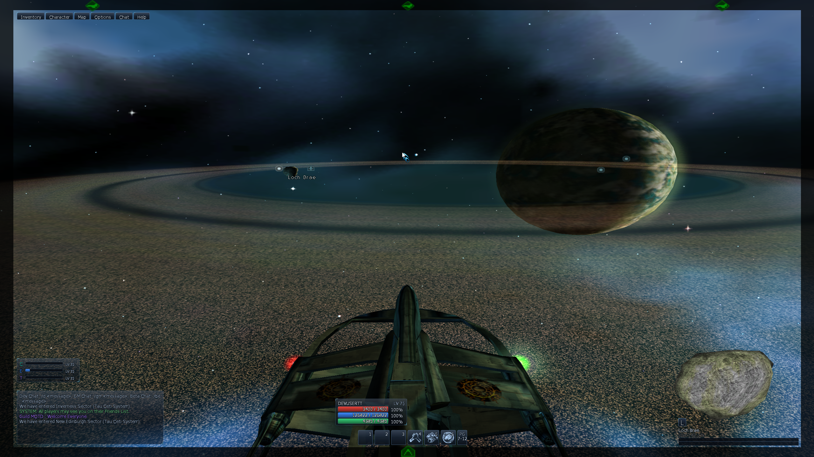
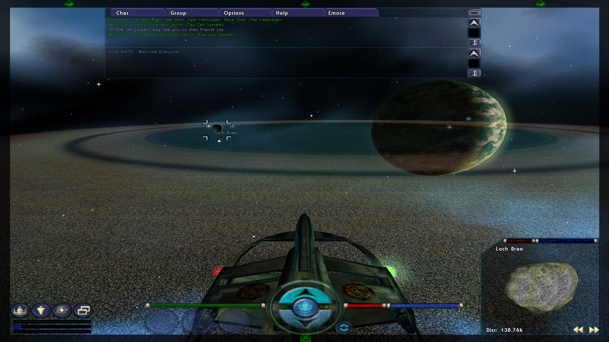
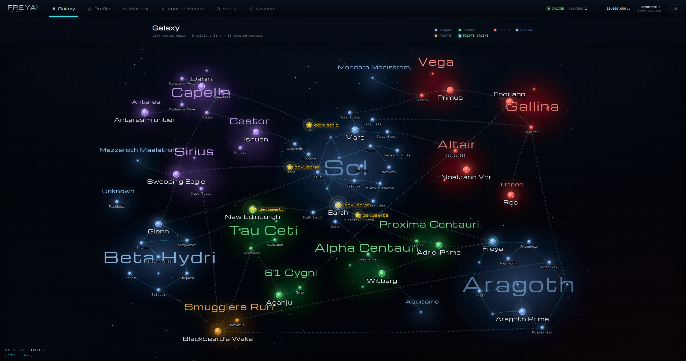
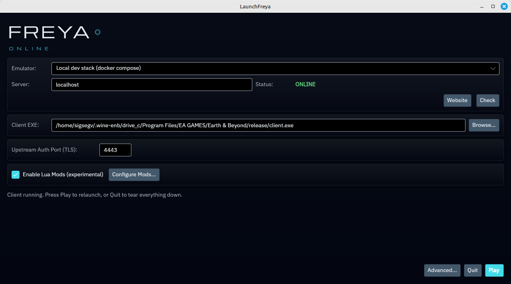

# Earth & Beyond emulator preservation project

> A consolidated, modernised home for the Earth & Beyond MMO server emulator. The goal is to keep the game playable on contemporary hardware; Linux server, Linux or Windows client; and bring the codebase forward enough that contributors can actually work on it again.

## Major changes in this fork

- server ported to Linux
- switched database to Postgres and parameterized queries
- tooling ported from WinForms to cross-platform Avalonia
- upgraded OpenSSL
- DTLS encryption between the server and the client proxy for UDP
- auth token prefix on UDP packets (binds each datagram to an authenticated account)
- sector servers spin up/down as needed when players gate/enter (cuts memory footprint 70%)
- added full integration test suite
- added CLI that can fully parse all network packet fields and can stimulate a client via REPL (you can log in and play the game through the CLI)
- added Discord bot that can display server status, who is logged in, and alert when players level up or log in/out
- added website with login, account panel, mailbox, auction house where you can auction your items from your Vault to other players
- added clientside Lua for user interface modding (Ctrl+U to toggle on and off)
- containerized everything
- added terraform/infra-as-code to make managing and spinning server up easier
- made a new launcher with options such as profiles, autofill username/pass, auto login to specific character, customize window positioning, launch multiple games (multibox)
- to avoid confusion for users, the launcher/etc for this project is called Freya to indicate that it has undergone significant changes from Net7. All original and derivative Net7 code remains Net7 licensed.

## A quick note

There is no publicly-open server officially hosted for this project. It's not meant to compete with Net-7. Live Net-7 is significantly more true to the old-school experience and accurate/complete/stable, it's just closed source. If you just want to play E&B and aren't interested in development or customization of the game, play Net-7. The main purpose for this is that I wanted something that is more open for fans to experiment and play E&B on their own terms and make their own modifications.

## Quick Start

1.  For Windows: install Earth & Beyond via publicly available `eandb_demo.exe`

    For Linux: run `./client/linux-installer/install-enb-linux.sh --demo-only`

2. patch up to ~retail (see `deploy/do/patches/enb-patch-readme.md` for more info, you need to figure out where to get this, you may be able to find the client patches from other emulators/online/your own retail cd/etc). I can't promise that ALL variations are the same but in general they should all function about the same. If you skip the `--demo-only` flag it will try to install the Net-7 patched version which may or may not work with the code in this repo.

3. run the following:
```
just run-stack-bg
just seed-account testclient testpw
just play-local
```

Then click **Play** in the Freya launcher and log in with username `testclient` / password `testpw`.

Alternatively, to fully log in from the CLI you can run the following (and you can also optionally add the character name). If you set the password to the string `PROMPT` it will prompt you instead of storing it in the bash command history. There's also env vars for each of those params if you prefer. This only works if you have at least 1 character, so launch with `just play-local` first until you create at least one.
```
just play-local testclient testpw
```

## What this is

Westwood's *Earth & Beyond* (2002) was shut down by EA in 2004. A community team at Net-7 Entertainment reverse-engineered the server protocol and built an open emulator in C++. That code split into multiple forks and drifted; the C# content editors lived in one repo, the server fork with the latest gameplay code lived in another, and a Linux client installer lived in a third.

This project is **one repo** that consolidates:

| Upstream | Lives in | What it brought |
|---|---|---|
| **tada-o fork** of Net-7 server (svn r2974, 2010-03-15) | `server/`, `login-server/`, `proxy/`, `launcher/`, `client/mods/`, `db/mysql/` | Newer/more complete C++ server (~162K LOC), the MySQL schema + seed data, ~20 ability implementations that other forks only had stubs for |
| **kyp snapshot** (older Net-7 snapshot, 2014 GitHub dump) | `tools/`, `archive/kyp-snapshot/` | Full C# editor suite (Sector, Mob, Mission, Faction, Item, Effect, TalkTree editors plus Station Tools, EnBPatcher, LaunchNet7, W3D Parser, etc.), the original Net-7 architecture documentation, packet captures, the historical Linux-port attempt |
| **enb-linux-installer** | `client/linux-installer/` | A GPLv3 bash script that automates installing and configuring the Windows client under WINE on Linux distros |

These projects it's based on are super old code but the Net-7 current codebase is private and otherwise inaccessible for extending, so this is the best I can do for now. If more modern code for that was released I'd be happy to build on it.

## Screenshots

Here's a demonstration of the new Lua UI modding capabilities


And the old UI for comparison


And here's the new galaxy map / site with auction house / vault / etc


And the new launcher


## Project status

Tracked in `plans/*.md`. 

## Quickstart

### Linux client (works today)

```
client/linux-installer/install-enb-linux.sh
```

Installs WINE + the Earth & Beyond client + the Net-7 launcher. See `client/linux-installer/README.md` for prerequisites and supported distros.

### Server (runs natively on Linux today)

```
just init         # first-run: bring up mysql:8.0 on :3307 and load both dumps
just dev          # docker-compose up server + proxy + login (in the background)
just build        # cmake build server + proxy + login, dotnet build tools
just test         # ctest + dotnet test
just package      # build OCI image of the server
```

`server`, `proxy`, and `login-server` all build clean against system OpenSSL 3.x and libpqxx 7.x, and pass the gtest suite plus the CLI-driven integration tests (33/33). See `docs/09-running-locally.md` for the walkthrough.

### C# content tools

```
dotnet build tools/FreyaTools.slnx
just launch                   # central Avalonia tool launcher (recommended)
just launch-sector-editor     # or jump straight to a specific editor
```

All user-facing editors are Avalonia 11 / .NET 10 ports that run natively on Linux -- no WINE. The original WinForms projects have been removed. See `tools/README.md` for the per-tool table.

### CLI packet inspector

`tools/cli-client/` is a headless C# REPL that drives the game protocol and decodes every S2C packet into structured fields with per-byte annotation (green background = decoded, orange = unknown).

**Live packet tail against a running stack:**

```bash
just dev                # bring up server + proxy + login in the background
just launch-cli         # open the REPL prompt

# inside the REPL:
dump-on                 # start printing every packet as it arrives, in colour
connect                 # connect to the server
login <user> <pass>     # authenticate
list                    # list characters on this account
enter <firstname>       # enter sector -- dumps the full handshake live
dump-off                # stop the tail
```

Each packet prints like:

```
<-- 0x0025 ItemBase  len=304
  [0000] ItemTemplateID    = 0x000021D1  (8657)  (BE)
  [0004] Category          = 10  (Weapon)
  [0010] FieldCount        = 12
  [0011]   Field[0].ID     = 11  Requires Level
  [0015]   Field[0].Value  = "Beam Weapon"
  ...
  [00AE] Flags             = 0x00000080  (128)  (NO_MANUFACTURE)
  [00B2] Name              = "Prototype B 8"
  [0094] ActEffects.Count  = 0  (BE)
  0000  00 00 21 D1 0A ...   <- green bytes decoded, orange bytes unknown
```

**Offline capture dump (no live server needed):**

```bash
just cli-replay                   # replay archive/replay/capture_1-sector-s2c.bin
just cli-replay capture_2         # replay a different capture file

# plain-text mode for piping:
NO_COLOR=1 just cli-replay | less

# filter to one opcode:
NO_COLOR=1 just cli-replay | grep -A 20 "ItemBase"

# count frames per opcode:
NO_COLOR=1 just cli-replay | grep "^#" | sed 's/ len=.*//' | sort | uniq -c | sort -rn
```

The `capture_1` file is the 101-frame retail S2C trace from `archive/replay/` (avatar "Ace", ship "Revenge of the Jenquai", sector 45151 Friendship 7). Every structured record class was verified byte-by-byte against it.

**Capturing and comparing a live session:**

```bash
# record a live session to a text file
NO_COLOR=1 just launch-cli | tee my-session.txt
# inside: dump-on, connect, login, enter, quit

# diff decoded fields from retail capture vs live server:
NO_COLOR=1 just cli-replay | grep "^\s*\[" > retail.txt
grep "^\s*\[" my-session.txt             > live.txt
diff retail.txt live.txt
```

See `docs/15-cli-client.md` for the full REPL command reference.

Or if you want to manually dump network traffic to compare:

```bash
ps aux | grep -i FreyaProxy # or whatever else you want to capture
sudo nsenter -t <PID> -n tcpdump -i any -nn -s0 -w network-capture.pcap
```

Dumping the proxy is a good idea as it's unencrypted. You can convert to hex with hexdump -C

**Dumping the cleartext proxy->client frames (what the client actually decodes):**

The `nsenter`/tcpdump capture above gets the proxy<->server UDP leg, which is NOT
what the client sees (the proxy re-frames, consumes, and fabricates -- see the
callout below). To capture the exact ordered byte stream the client receives,
set `PROXY_S2C_HEXDUMP=1` when launching: the proxy dumps every client-facing
frame at its send chokepoint, BEFORE RC4 encryption, so both passthrough AND
proxy-fabricated opcodes are logged in send order.

```bash
# launch with the client-facing dump on (works with play-local or play-cli):
PROXY_S2C_HEXDUMP=1 just play-local
# ... drive the scenario in the client, then pull the proxy log:
docker compose logs --no-color proxy > s2c.log      # all client-bound frames, tagged HEX(tx)
```

Each frame is logged as `HEX(tx) op=0x.... len=....` followed by offset-prefixed
hex rows, so the stream reassembles even if log lines interleave. This is the
DECRYPTED client leg as our proxy emits it.

**Decrypting a Windows net7proxy capture (the encrypted client<->proxy leg):**

The live dump above only works for our own proxy. To get the same DECRYPTED
client leg from a retail net7proxy session, capture it on Windows with
`proxy/scripts/Start-WindowsEnbProxyCapture.ps1` (it records both legs, including
the encrypted client<->proxy TCP) and then decrypt the capture offline. This
works because the Westwood RSA keypair is fixed and committed
(`proxy/WestwoodCrypto/WestwoodRSA.cs`), so the per-session RC4 key is recoverable
straight out of the captured handshake:

```bash
# on Windows: capture a retail session
.\proxy\scripts\Start-WindowsEnbProxyCapture.ps1
#   -> writes .\captures\<scenario>-...-<pid>-<timestamp>.pcapng

# anywhere with python3: decrypt + histogram the client-leg opcodes
python3 proxy/scripts/decrypt-client-leg.py captures/<scenario>-...-.pcapng
#   --proxy-port N   pin the proxy game port (otherwise auto-detected)
#   --max-ops K      how many top opcodes to print per connection
```

It auto-detects the proxy game port, RSA-decrypts each connection's client key
block, derives the reversed 8-byte RC4 key, RC4-decrypts the proxy->client
stream, walks the `[len:u16][op:u16][payload]` sub-packets, and prints a per-
connection and aggregate opcode histogram. The aggregate is directly comparable
to our `PROXY_S2C_HEXDUMP=1` log above -- same leg, same direction -- so retail
vs our proxy can be diffed opcode-for-opcode (which is exactly how the
client-facing emission counts get checked).

> **FreyaProxy is not a dumb relay.** It is an active protocol participant:
> on the server->client leg it strips the UDP outer header, consumes a
> whole band of control opcodes the client never sees (galaxy-map cache,
> prospect/loot, object create, the `0x2025`-`0x202e` gate-cache band, MVAS
> terminate, ...), drops malformed frames, rewrites a few payloads, fabricates
> packets the server never sent (resends, login handoff, visibility kicks,
> the MVAS feed), reassembles split packets, and re-frames everything onto
> its own encrypted client-facing TCP. Only opcodes `0x01..0xFE` ever reach
> the client. **So a server-side capture cannot be applied directly to
> `client.exe`, and a client-side capture cannot be replayed straight at the
> server**, without first accounting for what the proxy does to that opcode.
> The proxy's per-opcode behaviour (`proxy/UDPProxyToClient_linux.cpp`,
> `proxy/ClientToServer_linux_stubs.cpp`) is the source of truth; see
> `docs/03-network-protocol.md` §1 and CLAUDE.md. (`proxy/local-debug/` is a
> gitignored scratch dir for your own working captures, taken on the cleartext
> proxy<->server UDP leg, not the encrypted client<->proxy leg; the committed
> reference captures live in `archive/kyp-snapshot/capturedPackets/`.)

**Replaying a raw pcap capture (server->proxy UDP traffic):**

The Net-7 server sends sector S2C data as 0x2016/0x201A PACKET_SEQUENCE UDP frames.
`pcap_to_replay.py` extracts the inner game opcodes from those frames and writes an
ENBREPLAY binary that the CLI replay tool can parse:

```bash
# Convert a pcap to ENBREPLAY and replay it in one step:
just pcap-replay proxy/local-debug/foo.pcap

# With custom IPs (pass the reference server IP and the client/proxy IP):
just pcap-replay proxy/local-debug/foo.pcap 10.0.0.1 10.0.0.2

# Or run the converter directly to produce a persistent .bin:
python3 tools/pcap-to-replay/pcap_to_replay.py \
    --pcap proxy/local-debug/foo.pcap \
    --out  /tmp/foo.bin \
    --server SERVER_IP --client CLIENT_IP --verbose

# Then replay the .bin at any time:
printf 'replay /tmp/foo.bin\nquit\n' | \
    dotnet run --project tools/cli-client/src/CliClient.App -- start
```

The pcap must be a standard LE pcap (hexdump -C or wireshark export).
Only the UDP flows from server to client are extracted; RC4-encrypted
auth traffic and launcher opcodes are automatically skipped.

**Debugging client-only crashes**

Run the client with these options:

```bash
WINEDEBUG=+seh,+tid WINEPREFIX=~/.wine-enb just play-local 2>&1 | tee /tmp/client-crash.log
```

then, reproduce the crash and inspect the stack or the stuck binary, plus the logs produced.

### Testing with multiple players

The `just launch-cli` REPL above dials the host-published proxy on `127.0.0.1`,
so it shares that proxy with the WINE `client.exe` started by `just play-local`.
The FreyaProxy is a **single-client bridge** (one connection set, one logged-in
state), so two clients through the same proxy clobber each other -- one
disconnects the other. To run several clients at once, give each its **own
proxy** in a container.

```bash
just run-stack-bg        # shared stack: postgres + server + login + proxy

# each `play-cli` brings up a CLI + its own dedicated proxy on a private
# network, against the running stack. Run as many as you like; the UNIT arg
# names the container set so they don't collide.
just play-cli cli1       # first player
just play-cli cli2       # second player (in another terminal)

# inside each REPL:
connect                  # bare connect dials THIS unit's own proxy (cliproxy)
login <user> <pass>      # authenticate
enter <firstname>        # enter sector
```

Inside a `play-cli` container a bare `connect` already targets the unit's own
proxy (`N7_PROXY_HOST=cliproxy`); on the host stack it defaults to `127.0.0.1`.
Pass an explicit host (`connect cliproxy`, `connect 10.0.0.5:4443`) to override.

This composes freely: `just play-local` (the WINE client on the shared proxy)
can run at the same time as any number of `just play-cli` units, because each
has a proxy to itself.

Tear a unit's proxy down when finished:

```bash
just stop-cli cli1
```

### Rebuilds on launch (`ENB_NOREBUILD`)

`just play-local` and `just play-cli` **build-if-stale by default**: they run
`docker compose build` first, which Docker's layer cache turns into a
near-instant no-op for any service whose source did not change, then bring the
stack up so that **only** a container whose image actually changed is recreated.
So if you changed nothing, nothing rebuilds and nothing restarts -- and if you
changed C++ in `server/`, `proxy/`, or `login-server/`, the new binary is built
and only that container bounces. This is what avoids the *stale-image trap*
(testing an old binary because the container was never rebuilt). `play-cli`
never rebuilds or recreates the **shared** server/login/proxy -- it only builds
its own CLI unit -- so launching a CLI never disturbs another player's session.

Set **`ENB_NOREBUILD=1`** to force a pure attach: skip the build entirely and
start only containers that are missing, leaving every running container -- and
its in-flight player/session state -- exactly as-is. Use it when you know the
running binaries are current and must not bounce:

```bash
ENB_NOREBUILD=1 just play-local      # attach the WINE client, rebuild nothing
ENB_NOREBUILD=1 just play-cli cli2   # attach a second CLI, rebuild nothing
```

Both launchers print each image's build time and flag any image that *may* be
out of date (its source on disk is newer than the built image). To rebuild
explicitly without launching anything, use `just rebuild` (server/login/proxy)
or `just rebuild-cli <UNIT>` (a CLI unit).

One catch: the server force-kicks a duplicate login **per account** (this is
correct retail behaviour and is deliberately not bypassed). Give each
concurrent client a **distinct account**, not the same login twice.

See `docs/15-cli-client.md` for the REPL command reference and
`docker-compose.cli.yml` for the per-unit topology.

## Repo layout

See `CLAUDE.md` for the full directory map and rules. Short version:

- `server/`, `login-server/`, `proxy/`, `launcher/` - C++ server-side
- `client/` - Linux installer + client mods + Detours
- `tools/` - C# content editors
- `db/` - MySQL dumps (original) + Postgres schema (converted)
- `docs/` - architecture, protocol, modules, schema, abilities, tools, build, running, roadmap
- `plans/` - multi-phase plan files (source of truth for what's done/next)
- `archive/` - historical material from upstream repos that didn't make it into the active tree
- `LICENSES/` - license texts and the directory-by-directory license map

## License

**Non-commercial only.**

The project default license is **Creative Commons Attribution-NonCommercial-ShareAlike 3.0 United States** because the bulk of the inherited code (the Net-7 server) is under that license and we can't relicense it.

Entirely new code written for this project under the project name **Freya** is licensed **MIT** (copyright 2026 Max Verigin). This is the self-contained code under `freya/` - it produces its own new binaries/artifacts and does not depend on any Net-7 / tada-o source to compile. Existing code **not** in the `freya/*` folder is licensed to its owners under the appropriate licenses described below. If any Freya-named reference is mixed within Net-7 code, that code still follows the CC BY-NC-SA 3.0 license.

In particular, **modifications to existing server files (or the existing server binary) remain Net-7 CC BY-NC-SA 3.0 licensed** - editing an inherited file in place does not make it Freya/MIT, and you may not move such a file under `freya/` to relicense it.

- `LICENSES/enb-emulator` - project default (CC BY-NC-SA 3.0)
- `LICENSES/Freya` - MIT license (copyright 2026 Max Verigin) for the new code under `freya/`
- `LICENSES/Net7` - original Net-7 license header + deed URL
- `LICENSES/Tada-O` - note that tada-o adds no separate license; modifications inherit CC BY-NC-SA 3.0 under ShareAlike
- `LICENSES/enb-linux-installer` - GPLv3 verbatim (governs only `client/linux-installer/`)

Precedence: per-file header > per-folder `LICENSE` > `freya/` is MIT > project default. See `LICENSES/README.md` for the full directory-by-directory map.

## Credits

- **Net-7 Entertainment** (2005–2009) - the original team that built the emulator from reverse-engineered protocol work. None of this exists without them.
- **The tada-o contributors** - the post-Net-7 fork that landed the abilities, guild, and combat work consolidated here.
- **kyp / therealkyp** - the 2014 GitHub snapshot that preserved the C# editor suite, packet captures, and architecture docs.
- **Nimsy** - the original WINE-on-Linux guide whose steps became the basis of the installer.
- **ciphersimian** - author of the `enb-linux-installer` script.
- **Westwood Studios** - *Earth & Beyond* (2002, o7).
- **Electronic Arts** - All original assets, art and other items that belong to Electronic Arts remain their sole property with all rights reserved to them allowed by law.

## Contributing

Read `CLAUDE.md` first. It explains the plans workflow, repo layout, coding rules, and license precedence. Then look at `plans/00-master.md` to see what's in progress.
