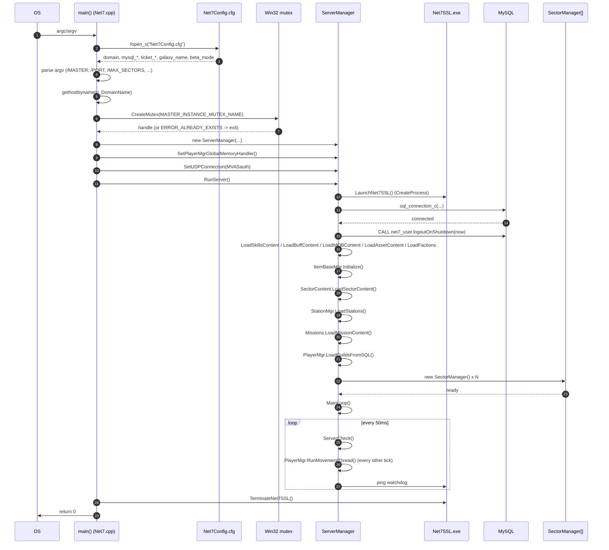
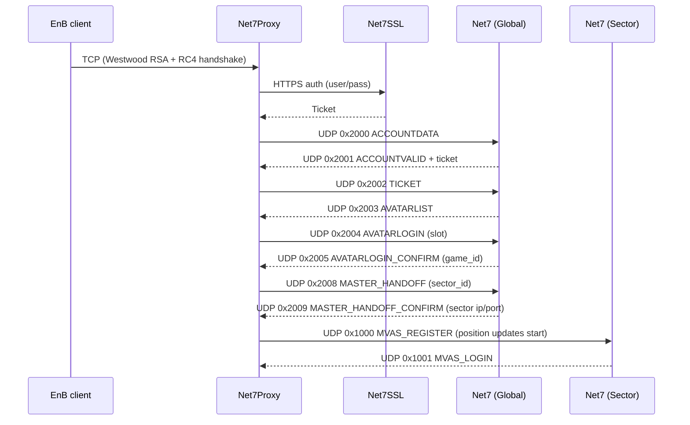

# 02 - Architecture

This document describes the runtime topology of the Net-7 server emulator
as it actually exists in the tada-o source tree. It is reconstructed from
the C++ source under `server/src/`, the original Net-7 architecture document
at `docs/reference/net7-architecture-original.rtf`, and the post-mortem
notes in `archive/kyp-snapshot/Documents/`.

The original Net-7 design imagined a fleet of dedicated server processes
(one per server type, one process per sector). In practice this fork
collapses everything into a single `Net7.exe` that runs either in
"Master/Global/Auth-host" mode or in "Sector" mode, with a sidecar
`Net7SSL.exe` for HTTPS authentication. The original design language
(GlobalServer, MasterServer, SectorServer) is still used in the source
even though all three live in the same process most of the time. Read on
with that in mind.

## Contents

1. [Process topology](#1-process-topology)
2. [Startup sequence](#2-startup-sequence)
3. [Server roles and boundaries](#3-server-roles-and-boundaries)
4. [Inter-process communication](#4-inter-process-communication)
5. [Main loop and timing](#5-main-loop-and-timing)
6. [The database layer](#6-the-database-layer)
7. [In-memory state managers](#7-in-memory-state-managers)
8. [Sector management](#8-sector-management)
9. [Where the original design diverges from the code](#9-where-the-original-design-diverges-from-the-code)

---

## 1. Process topology

A running deployment has between three and five distinct processes:

```
+----------------------+        +----------------------+
|     Net7Proxy        |  UDP   |       Net7.exe       |
| (per-client cleartext|<------>| Master/Global/Sector |
|  bridge; receives    |        | runtime, MySQL client|
|  TCP from the EnB    |        +----------+-----------+
|  client, sends UDP   |                   |
|  to Net7 + Net7SSL)  |        Windows mailslot
|                      |        + UDP loopback
|                      |                   |
|                      |        +----------+-----------+
|                      |        |     Net7SSL.exe      |
|                      |  HTTPS | OpenSSL TCP listener |
|                      |<------>| on :443; brokers     |
|                      |        | login / serves AVATAR|
+----------------------+        | INFO via UDP back to |
                                | Net7                 |
                                +----------------------+
        ^                                 ^
        |                                 |
        +-----------+         +-----------+
                    |         |
                +---+---------+----+
                |     MySQL 5.x    |
                |   (net7,         |
                |    net7_user     |
                |    schemas)      |
                +------------------+
```

`Net7.exe` is the C++ binary built from `server/src/`. `Net7SSL.exe` is
built from `login-server/Net7SSL/`. `Net7Proxy` is built from `proxy/`
and runs on the client side - it is what the Earth & Beyond game client
actually talks to, because the client expects a TCP connection to a
local address and this fork moved most of the traffic to UDP. Net7Proxy
translates between the two.

In the historical (pre-Net7Proxy) layout there were also separate
`GlobalServer`, `MasterServer` and per-`SectorServer` processes
communicating over TCP. That code path still exists, commented out, in
`server/src/ServerManager.cpp:147-159`. The current code path is UDP-only.

### Three roles, one binary

`Net7.exe` decides at startup which role it is playing based on argv:

| Mode | CLI flag | Role | Reference |
|---|---|---|---|
| Standalone | (no flags) | Master + Global + Auth + every sector in one process | `server/src/Net7.cpp:324` |
| Master/Galaxy | `/MASTER` | Master + Global + Auth, no sectors | `server/src/Net7.cpp:245` |
| Sector | `/PORT:N` | One or more sectors only | `server/src/Net7.cpp:254` |

The defaults assume standalone. The flag list is documented in
`Usage()` at `server/src/Net7.cpp:82` and parsed in the argv loop at
`server/src/Net7.cpp:239-296`. All other supported flags
(`/DOMAIN:`, `/MAX_SECTORS:`, `/ALTSECTORS`, `/ALLSECTORS`,
`/STARTSECTOR:`, `/DEBUG`) only modify which sectors load and how
many.

### Why two binaries

`Net7SSL.exe` exists because OpenSSL is statically linked and the
authentication TCP listener on port 443 needs to live in its own
address space so a crash in the auth path does not take down the whole
galaxy. `Net7` keeps a handle to the `Net7SSL` process, monitors it
with mailslot pings, and relaunches it if it goes silent for 60
seconds. See `server/src/ServerManager.cpp:366-374` for the watchdog
and `server/src/Net7.cpp:416-433` for the launch.

The mailslot ping protocol is two opcodes:

| Opcode | Direction | Meaning | Source |
|---|---|---|---|
| `0x04` LOCAL_PING_SSL_SERVER | SSL -> Net7 | Liveness | `server/src/MailslotManager.h:47` |
| `0x05` LOCAL_PING_SERVER_SSL | Net7 -> SSL | Liveness | `server/src/MailslotManager.h:48` |

On Linux there are no mailslots; the watchdog needs to be ported. See
section 4.

---

## 2. Startup sequence

`main()` at `server/src/Net7.cpp:91` performs the following sequence in
order. Step numbers below correspond to logical phases, not source
lines.



### Phase 1: configuration

`Net7Config.cfg` is read line by line at `server/src/Net7.cpp:124-209`.
It is a plain `key=value` text file. Recognised keys:

- `domain` (DNS name the server resolves at startup)
- `internal_ip`
- `mysql_user`, `mysql_pass`, `mysql_host`
- `ticket_user`, `ticket_pass`, `ticket_host`, `ticket_db`
- `galaxy_name`
- `use_dase` (boolean)
- `beta_mode`

If `Net7Config.cfg` is missing, the server writes out a default stub
with placeholder credentials and refuses to read it back (see the
`else` branch at `server/src/Net7.cpp:210-221`). The first run is
expected to fail and the operator is expected to edit the file.

There is no environment-variable equivalent. Phase B will need to add
one or the Postgres migration will be operationally awkward.

### Phase 2: process singleton

Only one Master and only one Sector-listener-on-a-given-port can
exist at a time. The lock is a named Windows kernel mutex created at
`server/src/Net7.cpp:360`. Mutex names:

| Constant | Defined in | Value |
|---|---|---|
| `MASTER_INSTANCE_MUTEX_NAME` | `server/src/ServerManager.h` (indirect) | "Net7 Master Server Instance Mutex" |
| `SECTOR_INSTANCE_MUTEX_NAME` | (indirect) | "Net7 Sector Server Instance Mutex on port %d" |
| `"Net7 Standalone Server Instance Mutex"` | `server/src/Net7.cpp:106` | literal |
| `SSL_INSTANCE_MUTEX_NAME` | `server/src/Net7.cpp:435` | "Net7SSL Instance" |

On Linux these have no direct equivalent. A flock on a pidfile or an
abstract Unix socket is the obvious shim and will need to land in
Phase B.

### Phase 3: ServerManager construction

The `ServerManager` constructor is in `server/src/ServerManager.cpp`
(line numbers under 100). It allocates:

- An `AccountManager` (only on Master/standalone)
- A `PlayerManager` (always)
- A `GMemoryHandler` (the in-process player slot pool)
- A `StringManager`
- A `SaveManager`
- A `JobManager`
- Three `CircularBuffer`s for UDP send / UDP resend / message logging
- `MAX_SECTORS` slots in `m_SectorMgrList[]` (filled lazily)

Most of these are kept as plain members of `ServerManager` rather than
pointers - see `server/src/ServerManager.h:121-166`. Globals like
`g_ServerMgr`, `g_PlayerMgr`, `g_AccountMgr`, `g_StringMgr`,
`g_ItemBaseMgr`, `g_SaveMgr`, `g_MailMgr` are wired up to the
manager instances so that the rest of the codebase can use them
without a back-pointer (declared in `server/src/Net7.h:261-268`).

### Phase 4: UDP listeners

Before `RunServer()` runs, `main()` creates one UDP listener that all
modes need:

- `MVASauth` on `MVAS_LOGIN_PORT` (3806), `CONNECTION_TYPE_MVAS_TO_PROXY`.
  Constructed at `server/src/Net7.cpp:385`.

`RunMasterServer()` adds another:

- `master_udp_listener` on `UDP_MASTER_SERVER_PORT` (3808),
  `CONNECTION_TYPE_MASTER_SERVER_TO_PROXY`.
  Constructed at `server/src/ServerManager.cpp:160`.

Each `UDP_Connection` spawns its own receiver thread in its constructor.
Windows uses `_beginthread`; Linux uses `pthread_create`. See
`server/src/UDPConnection.cpp:74-79`.

### Phase 5: content load

Before any client can connect, the Master loads its content from MySQL
into in-memory structures. This is sequential and slow:

| Step | Loader | What it loads | Reference |
|---|---|---|---|
| 1 | `SkillsList.LoadSkillsContent` | Skill table | `server/src/ServerManager.cpp:190` |
| 2 | `BuffData.LoadBuffContent` | Buff effects | `server/src/ServerManager.cpp:191` |
| 3 | `MOBList.LoadMOBContent` | NPC/monster templates | `server/src/ServerManager.cpp:192` |
| 4 | `AssetList.LoadAssetContent` | Ship and equipment assets | `server/src/ServerManager.cpp:193` |
| 5 | `FactionData.LoadFactions` | Faction relationships | `server/src/ServerManager.cpp:194` |
| 6 | `CBassetList.ParseRadii` | Collision radii from XML | `server/src/ServerManager.cpp:196` |
| 7 | `ItemBaseMgr.Initialize` | Items hash table | `server/src/ServerManager.cpp:202` |
| 8 | `SectorContent.LoadSectorContent` | Per-sector content | `server/src/ServerManager.cpp:203` |
| 9 | `StationMgr.LoadStations` | Stations | `server/src/ServerManager.cpp:206` |
| 10 | `SkillLoad.LoadSkills` | Skill hierarchy | `server/src/ServerManager.cpp:208` |
| 11 | `Missions.LoadMissionContent` | Missions | `server/src/ServerManager.cpp:212` |
| 12 | `PlayerMgr.LoadGuildsFromSQL` | Guilds | `server/src/ServerManager.cpp:214` |
| 13 | `JobMgr->InitialiseJobs` | Misc jobs | `server/src/ServerManager.cpp:215` |

Sector servers in distributed mode do not load all of this; they call
`SectorContentParser::LoadSectorContent` only (see
`server/src/ServerManager.cpp:283`).

### Phase 6: sector initialisation

`ServerManager::RunMasterServer` instantiates `m_MaxSectors`
`SectorManager` objects, one per sector slot, and sets per-sector
boundaries (`server/src/ServerManager.cpp:218-247`). It then calls
`m_SectorServerMgr.SectorLockdown()` and enters `MainLoop`. Sectors
do not yet have their listeners or threads; those come up later when
`ServerCheck` notices all assignments are complete and calls
`m_SectorMgrList[i]->BeginSectorThread()` at
`server/src/ServerManager.cpp:361`.

In distributed mode (`/PORT:N`), `RunSectorServer` instead binds a
`SectorManager` to each port starting at `m_Port` and increments
through ports as it finds them free
(`server/src/ServerManager.cpp:296-305`).

### Phase 7: main loop

See section 5.

---

## 3. Server roles and boundaries

### Original Net-7 vocabulary

The original Net-7 architecture document defines:

- **Authentication Server** - HTTPS on 443. Validates account / password,
  hands the client an opaque ticket. Implemented by `Net7SSL.exe`.
- **Global Server** - TCP on 3805. The galaxy directory. The client asks
  "what avatars do I have, give me a ticket for the one I want to
  play", and the Global Server replies with the avatar list and
  ultimately a `ServerRedirect` to a Master Server.
- **Master Server** - TCP on 3801. Galaxy-level coordination. Owns the
  avatar list, owns the per-sector dispatch table, and hands off
  players to Sector Servers.
- **Sector Server** - TCP on 3501 and up. Owns one sector at a time:
  the objects in it, the players who are flying around in it, combat,
  navigation, AI.

### Current vocabulary

After tada-o's UDP rework the wire protocol is UDP and the topology is
collapsed. The role names survive as `Connection_Type` constants in
`server/src/Net7.h:166-175`:

```c
#define CONNECTION_TYPE_CLIENT_TO_GLOBAL_SERVER         1
#define CONNECTION_TYPE_CLIENT_TO_MASTER_SERVER         2
#define CONNECTION_TYPE_CLIENT_TO_SECTOR_SERVER         3
#define CONNECTION_TYPE_MASTER_SERVER_TO_SECTOR_SERVER  4
#define CONNECTION_TYPE_SECTOR_SERVER_TO_SECTOR_SERVER  5
#define CONNECTION_TYPE_MVAS_TO_PROXY                   6
#define CONNECTION_TYPE_GLOBAL_SERVER_TO_PROXY          7
#define CONNECTION_TYPE_MASTER_SERVER_TO_PROXY          8
#define CONNECTION_TYPE_SECTOR_SERVER_TO_PROXY          9
#define CONNECTION_TYPE_GLOBAL_PROXY_TO_SERVER          10
```

Types 1-5 are the legacy TCP types and are still referenced by
`Connection.cpp` (`server/src/Connection.cpp` has dedicated handlers
for each). Types 6-10 are the UDP-via-Net7Proxy types and are dispatched
in `UDP_Connection::RunRecvThread` at
`server/src/UDPConnection.cpp:205-226`.

### Port assignments

`server/src/Net7.h:179-189`:

| Port | Macro | Used for | Role |
|---|---|---|---|
| 443 | `SSL_PORT` | HTTPS auth | Net7SSL |
| 3805 | `GLOBAL_SERVER_PORT` | TCP (legacy) | Net7 |
| 3801 | `MASTER_SERVER_PORT` | TCP (legacy) | Net7 |
| 3501 | `SECTOR_SERVER_PORT` | TCP (legacy, starts here, increments per sector) | Net7 |
| 3806 | `MVAS_LOGIN_PORT` | UDP | Net7 (MVAS = MVASlaunch, the launcher) |
| 3807 | `SSL_LOCALCERT_LOGIN_PORT` | TCP for local-cert dev mode | Net7SSL |
| 3808 | `UDP_MASTER_SERVER_PORT` | UDP master dispatch | Net7 |
| 3809 | `PROXY_SERVER_PORT` | Net7Proxy local | Proxy |

3500 is reserved as Net7Proxy's local TCP port; that is why sectors
start at 3501.

### Auth flow at the protocol layer

(More detail in `docs/03-network-protocol.md`.)



Compare with the SSL <-> Net7 server-side UDP traffic on the same
port, opcodes `0x4001`-`0x4004` and `0x5001`
(`server/src/UDP_SSLcomms.cpp`):

| Opcode | Direction | Meaning |
|---|---|---|
| `0x4001` SSL_REGISTER_S_SSL | Net7 -> SSL | Reply to SSL startup, hands SSL `MAX_ONLINE_PLAYERS` |
| `0x4002` SSL_PLAYERCOUNT | Net7 -> SSL | Current player count (every 5s) |
| `0x4003` SSL_AVATARLOGIN_SSL_S | SSL -> Net7 | "this avatar just authed" |
| `0x4004` SSL_AVATARCONFIRM_S_SSL | Net7 -> SSL | Login accepted/rejected |
| `0x5001` RETURN_PLAYER_COUNT | Net7 -> ??? | Reply to player count query |

---

## 4. Inter-process communication

There are three IPC mechanisms in active use plus one that is
deprecated:

### 4.1. Windows mailslots (Net7 <-> Net7SSL on the same host)

`server/src/MailslotManager.h:25-46`:

```c
class MailManager
{
public:
    MailManager(); // set up receive slot
    ~MailManager();

    bool WriteMessage(char *message);
    void CheckMessages();
    void HandleMessage(short opcode, short slot, short bytes);
    void HandleMessage();
    void ResetMailSystem();

private:
    void SetUpSendSlot();

    HANDLE m_hSlot;
    HANDLE m_hFile;
    HANDLE m_hEvent;
    bool   m_SendSlotInit;
    unsigned char m_Buffer[1024];
};
```

The send slot is created lazily by `SetUpSendSlot`, which calls
`CreateFile(g_OutputSlot, GENERIC_WRITE, ...)` at
`server/src/MailslotManager.cpp:195-211`. The receive slot is
created by `CreateMailslot(g_InputSlot, ...)` at
`server/src/MailslotManager.cpp:133`.

The slot names live in globals declared at the top of
`server/src/MailslotManager.h:21-23`:

```c
extern LPTSTR g_OutputSlot;
extern LPTSTR g_InputSlot;
extern LPTSTR g_EventName;
```

These are set in `Net7.cpp` to `\\\\.\\mailslot\\net7` (and
`...net7SSL`) and an event named `Net7Event` or similar.

`CheckMessages` is polled from `ServerCheck` every 50ms
(`server/src/ServerManager.cpp:343`). When the SSL ping goes silent
for >60 seconds, the Master logs an error and restarts the SSL
process (`server/src/ServerManager.cpp:366-374`).

**Linux porting**: Mailslots are Windows-only. The mechanically
simplest replacement is a Unix domain socket pair. The behaviour
needed is: write a small variable-length message; poll on read; have
the receiver block until a message arrives or a deadline elapses.
Both `SOCK_DGRAM` Unix sockets and named pipes (FIFOs) work. The
opcode set is tiny (two opcodes) so the IPC payload doesn't need
much structure.

### 4.2. UDP loopback (Net7 <-> Net7SSL)

`server/src/UDP_SSLcomms.cpp` is the in-process side of the
Net7 <-> Net7SSL UDP channel. This is distinct from the mailslot
channel: mailslots are used for liveness pings, UDP carries actual
login data. The choice of UDP for two processes on the same host
is unusual but consistent with the "everything is UDP now" rewrite.

Login flow on this channel (one client login):

1. SSL receives an HTTPS request from Net7Proxy with username +
   password.
2. SSL validates against the ticket DB.
3. SSL sends `0x4003 SSL_AVATARLOGIN_SSL_S` over UDP to Net7 with
   the avatar id, the client's IP, the character slot and the
   account name. Handled by
   `UDP_Connection::HandleSSLLogin` at
   `server/src/UDP_SSLcomms.cpp:55-86`.
4. Net7 allocates a player slot via `g_GlobMemMgr->GetPlayerNode(0)`,
   sets it up, and replies with `0x4004 SSL_AVATARCONFIRM_S_SSL`.
5. From that point on the player is logged in and the actual game
   traffic goes Client <-> Proxy <-> Net7.

### 4.3. UDP over the network (Net7 <-> Net7Proxy <-> client)

All gameplay traffic uses UDP. `UDP_Connection` is documented in
detail in `docs/03-network-protocol.md`. The dispatch by server type
is at `server/src/UDPConnection.cpp:205-226`:

```c
switch (m_ServerType)
{
case CONNECTION_TYPE_MVAS_TO_PROXY:
    HandleMVASOpcode(...);
case CONNECTION_TYPE_GLOBAL_SERVER_TO_PROXY:
    HandleGlobalOpcode(...);
case CONNECTION_TYPE_SECTOR_SERVER_TO_PROXY:
    HandleClientOpcode(...);
case CONNECTION_TYPE_MASTER_SERVER_TO_PROXY:
    HandleMasterOpcode(...);
}
```

### 4.4. TCP (legacy, deprecated but compiled)

Pre-tada-o the server also accepted direct TCP connections from
clients on 3801 / 3805 / 3501+. `Connection.cpp` still has the full
handler set:

```
ProcessGlobalServerOpcode
ProcessMasterServerOpcode
ProcessSectorServerOpcode
ProcessMasterServerToSectorServerOpcode
ProcessSectorServerToSectorServerOpcode
```

These are declared at `server/src/Connection.h:93-99`. The
`TcpListener` class (`server/src/TcpListener.h`) still exists but
the listener instantiations in `RunMasterServer` are commented out
(`server/src/ServerManager.cpp:147-159`).

The TCP path stays in the build because the proxy-to-server fallback
and the legacy server-to-server handoffs reuse the same `Connection`
infrastructure for the RC4 / RSA key exchange. See `Connection.h:171`
for `m_CryptIn`/`m_CryptOut` (RC4 streams) and `Connection.h:181` for
`m_WestwoodRSA`.

---

## 5. Main loop and timing

`ServerManager::MainLoop` is the only non-thread-local loop in the
process. It runs on the main thread, ticks at ~20 Hz (50ms target),
and only does bookkeeping. Real work is done in worker threads.

`server/src/ServerManager.cpp:439-468`:

```c
void ServerManager::MainLoop()
{
    u32 check_tick;
    long sleep_time;
    while (!g_ServerShutdown)
    {
        check_tick = GetNet7TickCount();
        ServerCheck();
        sleep_time = (long)(50 - (GetNet7TickCount() - check_tick));
        if (sleep_time < 0) sleep_time = 0;
        Sleep(sleep_time);
    }
    // ... shutdown
}
```

`ServerCheck` (`server/src/ServerManager.cpp:339`) does:

1. Polls Windows mailslots for SSL pings.
2. Runs `PlayerManager::RunMovementThread` on every other tick (so ~10
   Hz movement, ~20 Hz everything else). The throttle is the
   `m_SectorUpdateSelect` toggle.
3. If sector assignments are still pending, calls
   `m_SectorServerMgr.CheckConnections()`. When that returns true,
   spawns one thread per sector via
   `m_SectorMgrList[i]->BeginSectorThread()`.
4. Watches the SSL liveness timestamp; restarts SSL if it has been
   silent for 60 seconds.
5. Every 5 seconds, sends a `0x4002 SSL_PLAYERCOUNT` to SSL.

### Thread inventory

The runtime spawns the following threads:

| Thread | Started by | Number | Notes |
|---|---|---|---|
| Main / MainLoop | `main()` | 1 | The only non-thread-local code path |
| UDP receivers | `UDP_Connection` constructor | 1 per UDP_Connection | MVAS, master, possibly more |
| TCP receivers | `Connection::ReSetConnection` | 1 per active TCP connection | Legacy, mostly idle |
| Sector workers | `SectorManager::BeginSectorThread` | 1 per loaded sector | The real game tick |
| Save thread | `SaveManager` | 1 | Persists dirty Player and other dirty objects to MySQL |

Synchronisation is via a mix of `Mutex` (a wrapper around `CRITICAL_SECTION`
or `pthread_mutex_t`; see `server/src/Mutex.h`) and atomic primitives.
`PlayerManager` holds its own mutex (`m_Mutex` at
`server/src/PlayerManager.h:211`) for the player list. `Equipable`
holds its own mutex for per-equipped-item changes
(`server/src/CMobEquippable.h:154`). `Connection` holds one for
its TCP send queue.

### Shutdown

`g_ServerShutdown` is a global bool (declared at
`server/src/Net7.h:271`). It is set by:

- a console window control-C handler in `Net7.cpp` (`SetConsoleCtrlHandler`)
- the GM command `!shutdown`

Once set, `MainLoop` exits and the process drains. There is a 5-second
sleep at the end of `MainLoop` to let the save thread finish
(`server/src/ServerManager.cpp:467`). This is the "TODO: Use event
notification to make this safe" path.

---

## 6. The database layer

### MySQL is the only persistent store

Account data, characters, items, stations, missions, factions, skills,
buff definitions, MOB templates, asset templates, and guild state all
live in MySQL. The schema is in `db/mysql/net7.sql` plus
`db/mysql/net7_user.sql`. There are two schemas:

- `net7` - game content (items, missions, mobs, sectors, etc.)
- `net7_user` - user state (accounts, characters, guilds, etc.)

Connections are opened with `sql_connection_c` from the in-tree MySQL
wrapper at `server/src/mysql/`. Example pattern from
`server/src/ServerManager.cpp:172-186`:

```c
sql_connection_c connection( "net7_user", g_MySQL_Host,
                             g_MySQL_User, g_MySQL_Pass);
sql_query_c MissionTable( &connection );
sql_result_c result;
sprintf_s(QueryString, sizeof(QueryString),
         "CALL net7_user.logoutOnShutdown('%s');", timestr);
MissionTable.execute( QueryString );
```

There are 71 tables and 13+ stored procedures. The schema is
documented in `docs/06-database-schema.md`.

### The `*SQL.cpp` suffix convention

Each in-memory manager that loads from SQL has a companion file with
the `SQL` suffix:

- `server/src/AssetDatabase.h` / `server/src/AssetDatabaseSQL.cpp`
- `server/src/BuffDatabaseSQL.h/.cpp`
- `server/src/FactionDataSQL.h/.cpp`
- `server/src/ItemBaseSQL.cpp` (paired with `ItemBaseParser.cpp`)
- `server/src/MissionDatabaseSQL.h/.cpp`
- `server/src/MOBDatabaseSQL.cpp` (paired with `MOBDatabase.h`)
- `server/src/SectorContentSQL.cpp` (paired with `SectorContentParser.h`)
- `server/src/SkillsDatabaseSQL.cpp` (paired with `SkillsDatabase.h`)
- `server/src/Abilities/ATemplate.cpp` is a template for new abilities,
  not a SQL file.

These are intentionally separable so the loaders can be swapped (which
is what the Phase C Postgres migration will do: drop in
`*PostgresSQL.cpp` siblings or convert in place).

The lookup hot path stays in memory; SQL is only touched at startup
load, on character save, on guild change, and a handful of other
infrequent events. This is fine for several hundred concurrent
players.

### What lives in process memory vs MySQL

The rule is roughly: anything that can be recomputed from content
(MOB templates, item bases, asset templates, sector layouts, mission
text, faction graph) is loaded at startup and pinned in memory.
Anything that represents an individual player's state (character,
inventory, missions completed, kills, guild membership) is read
on login and written back on logout or on demand by the
SaveManager.

The implication is that "reload the server" is a heavy operation: the
content load (section 2, phase 5) takes a notable chunk of time and is
not concurrent.

---

## 7. In-memory state managers

The `ServerManager` constructor pulls in the following manager
classes as members or pointers. This is the canonical list of the
top-level subsystems. Each gets its own section in
`docs/04-server-modules.md`.

| Manager | Member of ServerManager | Header | Responsibility |
|---|---|---|---|
| `ConnectionManager` | (not a SM member, but referenced) | `server/src/ConnectionManager.h` | TCP/SSL connection list |
| `AccountManager*` | `m_AccountMgr` | `server/src/AccountManager.h` | Accounts, tickets, character slots |
| `SectorServerManager` | `m_SectorServerMgr` | `server/src/SectorServerManager.h` | Sector-to-port routing |
| `PlayerManager` | `m_PlayerMgr` | `server/src/PlayerManager.h` | All online players + groups + guilds |
| `ItemBaseManager` | `m_ItemBaseMgr` | `server/src/ItemBaseManager.h` | Item templates |
| `MissionHandler` | `m_Missions` | `server/src/MissionManager.h` | Missions |
| `MOBContent` | `m_MOBList` | `server/src/MOBDatabase.h` | NPC/monster templates |
| `Factions` | `m_FactionData` | `server/src/FactionDataSQL.h` | Faction graph |
| `SkillsContent` | `m_SkillsList` | `server/src/SkillsDatabase.h` | Skill table |
| `AssetContent` | `m_AssetList` | `server/src/AssetDatabase.h` | Ship/equip assets |
| `CBAssetParser` | `m_CBassetList` | `server/src/CBAssetParser.h` | Collision radii |
| `SectorContentParser` | `m_SectorContent` | `server/src/SectorContentParser.h` | Per-sector NPC/asteroid spawns |
| `UDP_Connection*` | `m_UDPConnection`, `m_UDPMasterConnection` | `server/src/UDPConnection.h` | UDP listeners |
| `GMemoryHandler*` | `m_GlobMemMgr` | `server/src/MemoryHandler.h` | Player slot pool (500 slots) |
| `StringManager*` | `m_StringMgr` | `server/src/StringManager.h` | String interning |
| `SaveManager*` | `m_SaveMgr` | `server/src/SaveManager.h` | Async character save thread |
| `JobManager*` | `m_JobMgr` | (`JobManager_DEP_` marked deprecated) | Crafting jobs |
| `BuffContent` | `m_BuffData` | `server/src/BuffDatabaseSQL.h` | Buff effect definitions |
| `StationLoader` | `m_StationMgr` | `server/src/StationLoader.h` | Stations / docks |
| `MailManager*` | `g_MailMgr` (global) | `server/src/MailslotManager.h` | SSL mailslot IPC |

Per-sector state is held by `SectorManager` (one per sector) which
in turn owns an `ObjectManager` (one per sector). See section 8.

---

## 8. Sector management

A sector is the unit of spatial subdivision in Earth & Beyond: a
loadable star system or sub-system that contains a finite number of
objects (planets, stations, asteroids, MOBs, players). Each sector is
identified by a numeric `sector_id`.

The sector-related class hierarchy:

```
SectorServerManager        - galaxy-level dispatch: sector_id -> ip/port
  +-- SectorRedirect entries (built when distributed sector servers
      register; mostly trivial in standalone mode)

ServerManager
  +-- m_SectorMgrList[MAX_SECTORS]  - one SectorManager per loaded sector
  |     SectorManager
  |       +-- ObjectManager           - per-sector object registry
  |             +-- list of MOBs, Husks, Hulks, MOBSpawns
  |             +-- list of Asteroid Fields
  |             +-- list of static and dynamic Objects
  |             +-- player list (transient: players currently in this sector)
  +-- m_SectorServerMgr               - dispatch
  +-- m_SectorContent                 - per-sector spawn data loaded from MySQL
```

### Sector lifecycle

1. **Construction**: in `RunMasterServer`, every `SectorManager` is
   constructed with the parent `ServerManager`. Boundaries and IP are
   set. The sector is not yet running.
2. **Sector lockdown**: `m_SectorServerMgr.SectorLockdown()` blocks
   the system from accepting new sector registrations.
3. **Thread start**: once `m_SectorAssignmentsComplete` is true (see
   `ServerCheck` at `server/src/ServerManager.cpp:353-364`),
   `BeginSectorThread()` is called on each `SectorManager`. From this
   point on each sector has its own thread driving its `ObjectManager`.
4. **Player handoff**: when a player jumps to a new sector, the Master
   server (`ProcessHandoff` at `server/src/UDP_Master.cpp:46`) looks
   up the IP and port of the target sector via
   `SectorServerManager::LookupSectorServer` and replies to Net7Proxy
   with `0x2009 MASTER_HANDOFF_CONFIRM` containing the ip/port.
5. **Sector shutdown**: on server shutdown each SectorManager is
   destroyed in `ServerManager::~ServerManager`
   (`server/src/ServerManager.cpp:109-110`).

In standalone mode all sectors share the same IP and port; the
"redirect" still happens but stays in-process.

In distributed mode (a separate Net7 process per sector), the redirect
crosses the network and the client's Net7Proxy reconnects to the
sector process.

### MAX_SECTORS

`server/src/SectorManager.h` defines `MAX_SECTORS`. The default is
300 (the cap is enforced at `server/src/Net7.cpp:352`). Realistic
sector counts for the game itself are around 150 named systems plus
`/ALLSECTORS` admin sectors up to 4595.

---

## 9. Where the original design diverges from the code

For anyone reading the Net-7 architecture RTF
(`docs/reference/net7-architecture-original.rtf`) and trying to map
it onto the source, the following are the gotchas:

- **No standalone Authentication Server process today**. The doc
  describes a Java/Tomcat-style auth tier with a session cookie. The
  current code has `Net7SSL.exe`, which is a C++ OpenSSL listener
  doing essentially the same thing but bound to the local Net7
  binary, not a load-balanced tier.
- **No separate GlobalServer / MasterServer processes**. The doc
  describes these as distinct binaries on distinct hosts. They are
  the same process in tada-o.
- **TCP is mostly dead**. The doc describes the protocol as TCP. The
  code path still exists but everything that actually goes anywhere
  is UDP via Net7Proxy.
- **No load balancer or galaxy-of-galaxies layer**. The doc mentions
  a GlobalServer brokering across multiple Master Servers (one per
  galaxy). In tada-o the Master Server *is* the Global Server in the
  same process. The 0x6D `GLOBAL_CONNECT` and 0x70 `AVATARLIST`
  opcodes still implement that pattern, but everything resolves to
  one host.
- **Mailslots, not message queues**. The doc generally refers to
  "messaging" between processes. In reality the only inter-process
  message bus in the code is the Windows mailslot pair between Net7
  and Net7SSL.
- **The "Web Server" is gone**. The doc shows a third process
  serving HTML status pages. The code retains a `WhoHtml()` method
  on `PlayerManager` (`server/src/PlayerManager.h:130`) that
  generates HTML, but there is no HTTP listener; the output appears
  to be written to disk for an external web server to consume.
- **MVAS** = MoVement ASsist. The launcher
  (`launcher/MVASlaunch/`) doubles as the per-client UDP origin for
  position updates. The architecture doc does not mention MVAS
  because it predates the rewrite.
- **Network7Proxy** is similarly post-doc. Treat the doc as
  describing the late-2000s Net-7 internal design, before the UDP
  rewrite happened.

For the actual on-the-wire protocol, see `docs/03-network-protocol.md`.
For per-module deep dives, see `docs/04-server-modules.md`.
