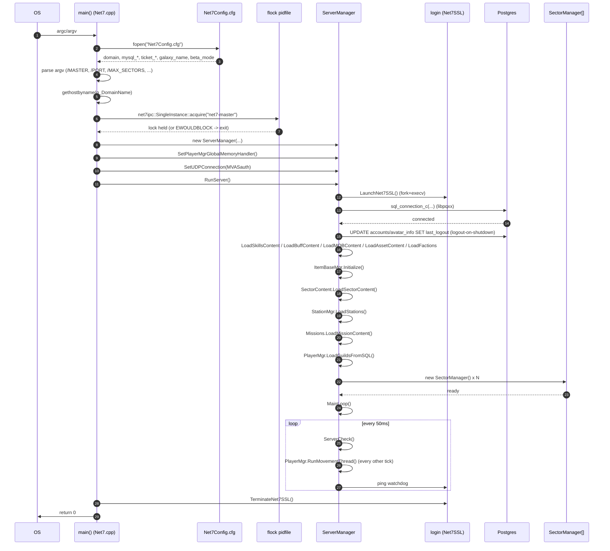
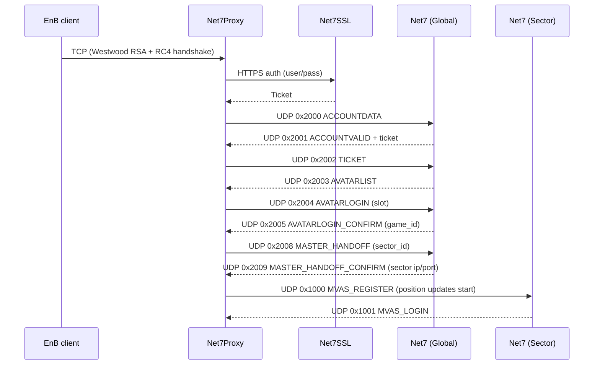

# 02 - Architecture

This document describes the runtime topology of the Net-7 server emulator
as it actually exists in the source tree. It is reconstructed from the C++
source under `server/src/`, the preserved Net-7 architecture document at
`docs/reference/net7-architecture-original.rtf`, and the supporting notes
in `archive/kyp-snapshot/Documents/`.

The original Net-7 design imagined a fleet of dedicated server processes
(one per server type, one process per sector). In practice this fork
collapses everything into a single `Net7.exe` that runs either in
"Master/Global/Auth-host" mode or in "Sector" mode, with a sidecar
`Net7SSL.exe` for HTTPS authentication. The original design language
(GlobalServer, MasterServer, SectorServer) is still used in the source
even though all three live in the same process most of the time. Read on
with that in mind.

## Contents

1. [Process topology](#1-process-topology)
2. [Startup sequence](#2-startup-sequence)
3. [Server roles and boundaries](#3-server-roles-and-boundaries)
4. [Inter-process communication](#4-inter-process-communication)
5. [Main loop and timing](#5-main-loop-and-timing)
6. [The database layer](#6-the-database-layer)
7. [In-memory state managers](#7-in-memory-state-managers)
8. [Sector management](#8-sector-management)
9. [Where the original design diverges from the code](#9-where-the-original-design-diverges-from-the-code)
10. [Wire-format header layout (`common/`)](#10-wire-format-header-layout-common)

---

## 1. Process topology

A running deployment has between three and five distinct processes:

```
+----------------------+        +----------------------+
|     Net7Proxy        |  UDP   |     server (Net7)    |
| (per-client cleartext|<------>| Master/Global/Sector |
|  bridge; receives    |        | runtime; Postgres    |
|  TCP from the EnB    |        | client (libpqxx)     |
|  client, sends UDP   |        +----------+-----------+
|  to server + login)  |                   |
|                      |        AF_UNIX SOCK_DGRAM
|  (no DB connection)  |        + UDP loopback
|                      |                   |
|                      |        +----------+-----------+
|                      |        |   login (Net7SSL)    |
|                      |  HTTPS | OpenSSL TCP listener |
|                      |<------>| on :443; brokers     |
|                      |        | login / serves AVATAR|
+----------------------+        | INFO via UDP back to |
                                | server; Postgres     |
                                | client (libpqxx)     |
                                +----------+-----------+
                                           |
                                           | libpqxx (server and login only;
                                           | the proxy never touches the DB)
                                           |
                                +----------+-------+
                                |    Postgres      |
                                |   (net7,         |
                                |    net7_user     |
                                |    databases)    |
                                +------------------+
```

The `server` binary is built from `server/src/`. The `login` binary
(named `Net7SSL` for source-history continuity) is built from
`login-server/Net7SSL/`. The
`proxy` binary is built from `proxy/` and runs on the client side -- it
is what the Earth & Beyond game client actually talks to, because the
client expects an (encrypted) TCP connection to a local address and this
fork moved most of the server traffic to UDP. The proxy translates
between the two, and it does far more than translate (see "The proxy is
not a dumb relay" below).

The `server` and `login` binaries are first-class Linux executables;
there is no WINE on the server side. The `proxy` is built from a single
cross-platform source tree and ships as **one implementation, two build
targets**:

- **Linux-native** (system OpenSSL) -- the docker `proxy` service, used
  server-side for our CLI/integration harness.
- **Win32 PE** (`x86_64-w64-mingw32-g++` via
  `proxy/cmake/mingw-w64-x86_64.toolchain.cmake`, static OpenSSL) -- the
  client-side build that runs in the same WINE prefix as `client.exe`,
  which is how real players run it (the client is a Win32 binary, so the
  proxy lives alongside it under WINE or on native Windows).

There is no second, platform-forked copy of the proxy: both targets
compile the same `proxy/*.cpp`. The old `NET7_LEGACY_WIN32`-walled twin
files are not present; the maintained logic lives in
`UDPProxyToClient_linux.cpp`, `UDPClient_linux.cpp`,
`ClientToServer_linux_stubs.cpp`, and the shared `Connection.cpp` /
`ServerManager.cpp` / `Net7.cpp`. (The `_linux` suffix is a misnomer;
those files are the cross-platform single source.)

The server itself has no TCP cluster: everything that goes anywhere on
the server side is UDP, dispatched through `server/src/UDP_*.cpp`. The
client-facing TCP terminator (`Connection.cpp`, `SSL_Listener.cpp`,
`SSL_Connection.cpp`, `TcpListener.h`) lives only in the proxy, because
the proxy is the thing that speaks the client's encrypted TCP.

### The proxy is not a dumb relay

The proxy is an active protocol participant, not a passthrough. On the
server->client leg it strips the 12-byte UDP outer header, walks the
packed `[length][opcode][payload]` sub-packets, **consumes** an entire
band of control / proxy-management opcodes the client never sees
(galaxy-map cache, prospect/tractor/loot, object create, login-stage
confirm, the 0x2025..0x202e gate-cache band, MVAS terminate, ...),
**drops** malformed or undersized frames, **rewrites** a few payloads in
flight, **generates** packets the server never sent (resend requests,
login handoff, 0x3004/0x3008 visibility kicks, the MVAS position feed),
**reassembles** split packets, and **re-frames** everything that survives
onto its own client-facing TCP framing. Only opcodes `0x01..0xFE` are
ever forwarded to the client's game receiver; anything else is consumed
or rejected. It also **encrypts**: client<->proxy TCP is Westwood RSA +
dual RC4, while proxy<->server UDP is cleartext.

The practical consequence -- spelled out in CLAUDE.md and in
`docs/03-network-protocol.md` -- is that a Net7 server-side packet capture
can **not** be applied directly to `client.exe`, and a client-side capture
can **not** be replayed straight at the server, without first accounting
for what the proxy does to that opcode in that direction. The proxy's
per-opcode behaviour (`proxy/UDPProxyToClient_linux.cpp`,
`proxy/ClientToServer_linux_stubs.cpp`) is the source of truth for that
mapping.

### Three roles, one binary

`Net7.exe` decides at startup which role it is playing based on argv:

| Mode | CLI flag | Role |
|---|---|---|
| Standalone | (no flags) | Master + Global + Auth + every sector in one process |
| Master/Galaxy | `/MASTER` | Master + Global + Auth, no sectors |
| Sector | `/PORT:N` | One or more sectors only |

The role is decided in the argv loop in `main()` (`server/src/Net7.cpp:133`).

The defaults assume standalone. The flag list is documented in
`Usage()` at `server/src/Net7.cpp:92` and parsed in the argv loop in
`main()`. All other supported flags
(`/DOMAIN:`, `/MAX_SECTORS:`, `/ALTSECTORS`, `/ALLSECTORS`,
`/STARTSECTOR:`, `/DEBUG`) only modify which sectors load and how
many.

### Why two binaries

The login process exists because the authentication TCP listener on
port 443 needs to live in its own address space so a crash in the auth
path does not take down the whole galaxy. The server keeps the login
process under a watchdog: it monitors liveness via the local IPC bus
and relaunches login if it goes silent for 60 seconds. See
`server/src/ServerManager.cpp:366-374` for the watchdog and
`server/src/Net7.cpp:416-433` for the launch.

The liveness ping protocol is two opcodes:

| Opcode | Direction | Meaning | Source |
|---|---|---|---|
| `0x04` LOCAL_PING_SSL_SERVER | login -> server | Liveness | `server/src/MailslotManager.h:47` |
| `0x05` LOCAL_PING_SERVER_SSL | server -> login | Liveness | `server/src/MailslotManager.h:48` |

The class name is historical; on Linux the underlying transport is an
AF_UNIX `SOCK_DGRAM` pair (`net7ipc::PosixIpc` in
`common/include/net7/PosixIpc.h`), not a Windows mailslot. See
section 4.

---

## 2. Startup sequence

`main()` at `server/src/Net7.cpp:133` performs the following sequence in
order. Step numbers below correspond to logical startup stages, not source
lines.


```mermaid
sequenceDiagram
    autonumber
    participant OS
    participant main as main() (Net7.cpp)
    participant cfg as Net7Config.cfg
    participant Lock as flock pidfile
    participant SM as ServerManager
    participant SSL as login (Net7SSL)
    participant DB as Postgres
    participant SecMgrs as SectorManager[]

    OS->>main: argc/argv
    main->>cfg: fopen("Net7Config.cfg")
    cfg-->>main: domain, mysql_*, ticket_*, galaxy_name, beta_mode
    main->>main: parse argv (/MASTER, /PORT, /MAX_SECTORS, ...)
    main->>main: gethostbyname(g_DomainName)
    main->>Lock: net7ipc::SingleInstance::acquire("net7-master")
    Lock-->>main: lock held (or EWOULDBLOCK -> exit)
    main->>SM: new ServerManager(...)
    main->>SM: SetPlayerMgrGlobalMemoryHandler()
    main->>SM: SetUDPConnection(MVASauth)
    main->>SM: RunServer()
    SM->>SSL: LaunchNet7SSL() (fork+execv)
    SM->>DB: sql_connection_c(...) (libpqxx)
    DB-->>SM: connected
    SM->>DB: UPDATE accounts/avatar_info SET last_logout (logout-on-shutdown)
    SM->>SM: LoadSkillsContent / LoadBuffContent / LoadMOBContent / LoadAssetContent / LoadFactions
    SM->>SM: ItemBaseMgr.Initialize()
    SM->>SM: SectorContent.LoadSectorContent()
    SM->>SM: StationMgr.LoadStations()
    SM->>SM: Missions.LoadMissionContent()
    SM->>SM: PlayerMgr.LoadGuildsFromSQL()
    SM->>SecMgrs: new SectorManager() x N
    SecMgrs-->>SM: ready
    SM->>SM: MainLoop()
    loop every 50ms
        SM->>SM: ServerCheck()
        SM->>SM: PlayerMgr.RunMovementThread() (every other tick)
        SM->>SSL: ping watchdog
    end
    main->>SSL: TerminateNet7SSL()
    main->>OS: return 0
```

### Stage 1: configuration

`Net7Config.cfg` is read line by line at `server/src/Net7.cpp:124-209`.
It is a plain `key=value` text file. Recognised keys:

- `domain` (DNS name the server resolves at startup)
- `internal_ip`
- `mysql_user`, `mysql_pass`, `mysql_host`
- `ticket_user`, `ticket_pass`, `ticket_host`, `ticket_db`
- `galaxy_name`
- `use_dase` (boolean)
- `beta_mode`

If `Net7Config.cfg` is missing, the server writes out a default stub
with placeholder credentials and refuses to read it back (see the
`else` branch at `server/src/Net7.cpp:210-221`). The first run is
expected to fail and the operator is expected to edit the file.

There is no environment-variable equivalent.

### Stage 2: process singleton

Only one Master and only one Sector-listener-on-a-given-port can
exist at a time. On Linux the lock is a `flock(LOCK_EX | LOCK_NB)`
on a pidfile under `/run/net7-ipc/`, wrapped by
`net7ipc::SingleInstance` (`common/include/net7/SingleInstance.h`).
The class names mirror the original Win32 mutex names so the lookups
stay readable:

| Constant | Defined in | Pidfile / lock-name |
|---|---|---|
| `MASTER_INSTANCE_MUTEX_NAME` | `server/src/ServerManager.h` (indirect) | "net7-master-server" |
| `SECTOR_INSTANCE_MUTEX_NAME` | (indirect) | "net7-sector-server-port-%d" |
| `"Net7 Standalone Server Instance Mutex"` | `server/src/Net7.cpp:106` | "net7-standalone-server" |
| `SSL_INSTANCE_MUTEX_NAME` | `server/src/Net7.cpp:435` | "net7-ssl" |

If another instance already holds the flock the acquire returns
`EWOULDBLOCK` and the new process exits. The lock is a POSIX `flock`,
not a Win32 named mutex; the mutex-name constants survive only as the
pidfile/lock-name strings.

### Stage 3: ServerManager construction

The `ServerManager` constructor is in `server/src/ServerManager.cpp`
(line numbers under 100). It allocates:

- An `AccountManager` (only on Master/standalone)
- A `PlayerManager` (always)
- A `GMemoryHandler` (the in-process player slot pool)
- A `StringManager`
- A `SaveManager`
- A `JobManager`
- Three `CircularBuffer`s for UDP send / UDP resend / message logging
- `MAX_SECTORS` slots in `m_SectorMgrList[]` (filled lazily)

Most of these are kept as plain members of `ServerManager` rather than
pointers - see `server/src/ServerManager.h:121-166`. Globals like
`g_ServerMgr`, `g_PlayerMgr`, `g_AccountMgr`, `g_StringMgr`,
`g_ItemBaseMgr`, `g_SaveMgr`, `g_MailMgr` are wired up to the
manager instances so that the rest of the codebase can use them
without a back-pointer (declared in `server/src/Net7.h:261-268`).

### Stage 4: UDP listeners

Before `RunServer()` runs, `main()` creates one UDP listener that all
modes need:

- `MVASauth` on `MVAS_LOGIN_PORT` (3806), `CONNECTION_TYPE_MVAS_TO_PROXY`.
  Constructed at `server/src/Net7.cpp:385`.

`RunMasterServer()` adds another:

- `master_udp_listener` on `UDP_MASTER_SERVER_PORT` (3808),
  `CONNECTION_TYPE_MASTER_SERVER_TO_PROXY`.
  Constructed at `server/src/ServerManager.cpp:160`.

Each `UDP_Connection` spawns its own receiver thread in its constructor
via `pthread_create` (`server/src/UDPConnection.cpp:80`).

### Stage 5: content load

Before any client can connect, the Master loads its content from Postgres
into in-memory structures. This is sequential and slow:

| Step | Loader | What it loads | Reference |
|---|---|---|---|
| 1 | `SkillsList.LoadSkillsContent` | Skill table | `server/src/ServerManager.cpp:190` |
| 2 | `BuffData.LoadBuffContent` | Buff effects | `server/src/ServerManager.cpp:191` |
| 3 | `MOBList.LoadMOBContent` | NPC/monster templates | `server/src/ServerManager.cpp:192` |
| 4 | `AssetList.LoadAssetContent` | Ship and equipment assets | `server/src/ServerManager.cpp:193` |
| 5 | `FactionData.LoadFactions` | Faction relationships | `server/src/ServerManager.cpp:194` |
| 6 | `CBassetList.ParseRadii` | Collision radii from XML | `server/src/ServerManager.cpp:196` |
| 7 | `ItemBaseMgr.Initialize` | Items hash table | `server/src/ServerManager.cpp:202` |
| 8 | `SectorContent.LoadSectorContent` | Per-sector content | `server/src/ServerManager.cpp:203` |
| 9 | `StationMgr.LoadStations` | Stations | `server/src/ServerManager.cpp:206` |
| 10 | `SkillLoad.LoadSkills` | Skill hierarchy | `server/src/ServerManager.cpp:208` |
| 11 | `Missions.LoadMissionContent` | Missions | `server/src/ServerManager.cpp:212` |
| 12 | `PlayerMgr.LoadGuildsFromSQL` | Guilds | `server/src/ServerManager.cpp:214` |
| 13 | `JobMgr->InitialiseJobs` | Misc jobs | `server/src/ServerManager.cpp:215` |

Sector servers in distributed mode do not load all of this; they call
`SectorContentParser::LoadSectorContent` only (see
`server/src/ServerManager.cpp:283`).

### Stage 6: sector initialisation

`ServerManager::RunMasterServer` allocates the `m_MaxSectors`
`SectorManager` slots in `m_SectorMgrList[]` (the constructor loop,
`server/src/ServerManager.cpp:142`), calls
`m_SectorServerMgr.SectorLockdown()`, and enters `MainLoop`. The slots
exist but the sectors are not running: sectors start lazily on the first
player handoff, not eagerly at boot. When a player is routed into a
sector, `UDP_Master::ProcessHandoff` calls
`ServerManager::EnsureSectorStarted` (`server/src/ServerManager.cpp:662`),
which cold-starts that sector (loads its objects, binds its deterministic
UDP port, spins up its thread) before the `0x2009 MASTER_HANDOFF_CONFIRM`
reports the port back to the proxy. Idle sectors are later parked by
`ServerManager::TeardownSector` (`server/src/ServerManager.cpp:760`) to
reclaim memory; the slot stays allocated and a later handoff re-starts it.
`m_SectorCount` is an active-online tally, bumped on cold-start and
decremented on teardown.

In distributed mode (`/PORT:N`), `RunSectorServer` binds a `SectorManager`
to each port starting at `m_Port` and increments through ports as it finds
them free.

### Stage 7: main loop

See section 5.

---

## 3. Server roles and boundaries

### Original Net-7 vocabulary

The original Net-7 architecture document defines:

- **Authentication Server** - HTTPS on 443. Validates account / password,
  hands the client an opaque ticket. Implemented by `Net7SSL.exe`.
- **Global Server** - TCP on 3805. The galaxy directory. The client asks
  "what avatars do I have, give me a ticket for the one I want to
  play", and the Global Server replies with the avatar list and
  ultimately a `ServerRedirect` to a Master Server.
- **Master Server** - TCP on 3801. Galaxy-level coordination. Owns the
  avatar list, owns the per-sector dispatch table, and hands off
  players to Sector Servers.
- **Sector Server** - TCP on 3501 and up. Owns one sector at a time:
  the objects in it, the players who are flying around in it, combat,
  navigation, AI.

### Current vocabulary

After tada-o's UDP rework the wire protocol is UDP and the topology is
collapsed. The role names survive as `Connection_Type` constants in
`server/src/Net7.h:166-175`:

```c
#define CONNECTION_TYPE_CLIENT_TO_GLOBAL_SERVER         1
#define CONNECTION_TYPE_CLIENT_TO_MASTER_SERVER         2
#define CONNECTION_TYPE_CLIENT_TO_SECTOR_SERVER         3
#define CONNECTION_TYPE_MASTER_SERVER_TO_SECTOR_SERVER  4
#define CONNECTION_TYPE_SECTOR_SERVER_TO_SECTOR_SERVER  5
#define CONNECTION_TYPE_MVAS_TO_PROXY                   6
#define CONNECTION_TYPE_GLOBAL_SERVER_TO_PROXY          7
#define CONNECTION_TYPE_MASTER_SERVER_TO_PROXY          8
#define CONNECTION_TYPE_SECTOR_SERVER_TO_PROXY          9
#define CONNECTION_TYPE_GLOBAL_PROXY_TO_SERVER          10
```

Types 1-5 are the legacy TCP types. The TCP cluster that once consumed
them (`Connection.cpp`, `ConnectionManager.cpp`, `ClientTo*Server.cpp`,
`TcpListener.h`, `SSL_Listener.cpp`, `SSL_Connection.cpp`) is not present
in `server/src/`. The constants remain in the enum because the proxy <->
server UDP framing reuses them as type tags. Types 6-10 are the
UDP-via-Net7Proxy types and are dispatched in
`UDP_Connection::RunRecvThread` (`server/src/UDPConnection.cpp:214`).

### Port assignments

Defined in `common/include/net7/Ports.h`, the single source of truth for
port assignments shared by the server, proxy, and login-server.

| Port | Macro | Used for | Role |
|---|---|---|---|
| 443 | `SSL_PORT` | HTTPS auth | Net7SSL |
| 3805 | `GLOBAL_SERVER_PORT` | TCP | Proxy (listens), Net7 (advertises) |
| 3801 | `MASTER_SERVER_PORT` | TCP | Net7 (master role) |
| 3500 | `PROXY_LOCAL_TCP_PORT` | TCP, proxy's own local terminator | Proxy |
| 3501 | `SECTOR_SERVER_PORT` | TCP, sectors start here and increment per sector | Net7 (sector role) |
| 3806 | `MVAS_LOGIN_PORT` | UDP | Net7 (MVAS = MVASlaunch, the launcher) |
| 3807 | `SSL_LOCALCERT_LOGIN_PORT` | TCP for local-cert dev mode | Net7SSL |
| 3808 | `UDP_MASTER_SERVER_PORT` | UDP master dispatch | Net7 |
| 3809 | `PROXY_SERVER_PORT` | Net7Proxy local | Proxy |

### Auth flow at the protocol layer

(More detail in `docs/03-network-protocol.md`.)


```mermaid
sequenceDiagram
    participant Client as EnB client
    participant Proxy as Net7Proxy
    participant SSL as Net7SSL
    participant Net7 as Net7 (Global)
    participant Sector as Net7 (Sector)

    Client->>Proxy: TCP (Westwood RSA + RC4 handshake)
    Proxy->>SSL: HTTPS auth (user/pass)
    SSL-->>Proxy: Ticket
    Proxy->>Net7: UDP 0x2000 ACCOUNTDATA
    Net7-->>Proxy: UDP 0x2001 ACCOUNTVALID + ticket
    Proxy->>Net7: UDP 0x2002 TICKET
    Net7-->>Proxy: UDP 0x2003 AVATARLIST
    Proxy->>Net7: UDP 0x2004 AVATARLOGIN (slot)
    Net7-->>Proxy: UDP 0x2005 AVATARLOGIN_CONFIRM (game_id)
    Proxy->>Net7: UDP 0x2008 MASTER_HANDOFF (sector_id)
    Net7-->>Proxy: UDP 0x2009 MASTER_HANDOFF_CONFIRM (sector ip/port)
    Proxy->>Sector: UDP 0x1000 MVAS_REGISTER (position updates start)
    Sector-->>Proxy: UDP 0x1001 MVAS_LOGIN
```

Compare with the SSL <-> Net7 server-side UDP traffic on the same
port, opcodes `0x4001`-`0x4004` and `0x5001`
(`server/src/UDP_SSLcomms.cpp`):

| Opcode | Direction | Meaning |
|---|---|---|
| `0x4001` SSL_REGISTER_S_SSL | Net7 -> SSL | Reply to SSL startup, hands SSL `MAX_ONLINE_PLAYERS` |
| `0x4002` SSL_PLAYERCOUNT | Net7 -> SSL | Current player count (every 5s) |
| `0x4003` SSL_AVATARLOGIN_SSL_S | SSL -> Net7 | "this avatar just authed" |
| `0x4004` SSL_AVATARCONFIRM_S_SSL | Net7 -> SSL | Login accepted/rejected |
| `0x5001` RETURN_PLAYER_COUNT | Net7 -> ??? | Reply to player count query |

---

## 4. Inter-process communication

There are three IPC mechanisms in active use plus one that is
deprecated:

### 4.1. AF_UNIX SOCK_DGRAM (server <-> login on the same host)

The class is called `MailManager` for source-history continuity, but its
implementation is an `AF_UNIX SOCK_DGRAM` socket pair under
`/run/net7-ipc/` -- not a Win32 mailslot.

`server/src/MailslotManager.h:25-46`:

```c
class MailManager
{
public:
    MailManager(); // set up receive socket
    ~MailManager();

    bool WriteMessage(char *message);
    void CheckMessages();
    void HandleMessage(short opcode, short slot, short bytes);
    void HandleMessage();
    void ResetMailSystem();

private:
    void SetUpSendSlot();

    int    m_Recv;          // AF_UNIX SOCK_DGRAM receive fd
    int    m_Send;          // AF_UNIX SOCK_DGRAM send fd
    bool   m_SendSlotInit;
    unsigned char m_Buffer[1024];
};
```

The send fd is created lazily by `SetUpSendSlot`, the receive fd
on construction. Both call into `net7ipc::PosixIpc` (declared in
`common/include/net7/PosixIpc.h`) which owns the socket-name
convention. There are no Win32-shaped slot/event globals (`g_OutputSlot`,
`g_InputSlot`, `g_EventName`); the transport is POSIX sockets throughout.

`CheckMessages` is polled from `ServerCheck` every 50ms
(`server/src/ServerManager.cpp:343`). When the login ping goes
silent for >60 seconds, the Master logs an error and restarts the
login process (`server/src/ServerManager.cpp:366-374`).

The IPC volume is shared with the login container via the
docker-compose `volumes:` mount; the login container's entrypoint
chmods `/run/net7-ipc/` to 0777 so the server (running as net7:net7
uid 999) can bind there.

### 4.2. UDP loopback (Net7 <-> Net7SSL)

`server/src/UDP_SSLcomms.cpp` is the in-process side of the
Net7 <-> Net7SSL UDP channel. This is distinct from the mailslot
channel: mailslots are used for liveness pings, UDP carries actual
login data. The choice of UDP for two processes on the same host
is unusual but consistent with the "everything is UDP now" rewrite.

Login flow on this channel (one client login):

1. SSL receives an HTTPS request from Net7Proxy with username +
   password.
2. SSL validates against the ticket DB.
3. SSL sends `0x4003 SSL_AVATARLOGIN_SSL_S` over UDP to Net7 with
   the avatar id, the client's IP, the character slot and the
   account name. Handled by
   `UDP_Connection::HandleSSLLogin` at
   `server/src/UDP_SSLcomms.cpp:55-86`.
4. Net7 allocates a player slot via `g_GlobMemMgr->GetPlayerNode(0)`,
   sets it up, and replies with `0x4004 SSL_AVATARCONFIRM_S_SSL`.
5. From that point on the player is logged in and the actual game
   traffic goes Client <-> Proxy <-> Net7.

### 4.3. UDP over the network (Net7 <-> Net7Proxy <-> client)

All gameplay traffic uses UDP. `UDP_Connection` is documented in
detail in `docs/03-network-protocol.md`. The dispatch by server type
is at `server/src/UDPConnection.cpp:205-226`:

```c
switch (m_ServerType)
{
case CONNECTION_TYPE_MVAS_TO_PROXY:
    HandleMVASOpcode(...);
case CONNECTION_TYPE_GLOBAL_SERVER_TO_PROXY:
    HandleGlobalOpcode(...);
case CONNECTION_TYPE_SECTOR_SERVER_TO_PROXY:
    HandleClientOpcode(...);
case CONNECTION_TYPE_MASTER_SERVER_TO_PROXY:
    HandleMasterOpcode(...);
}
```

### 4.4. No server-side TCP

The server does not accept direct TCP connections from clients. The
historical TCP cluster (`Connection`, `ConnectionManager`, `TcpListener`,
`SSL_Listener` / `SSL_Connection`, `ClientTo{Master,Global,Sector}Server`,
`EffectManager`, `JobManager_DEP_`) is not present in `server/src/`, and
`ServerManager` holds no `m_ConnectionMgr` field. The client's encrypted
RSA + dual-RC4 TCP terminator lives only in the proxy. The cipher
implementation is shared between the proxy and the C# CLI client via
`common/include/net7/WestwoodRC4.h` and
`common/include/net7/WestwoodRSA.h`.

---

## 5. Main loop and timing

`ServerManager::MainLoop` is the only non-thread-local loop in the
process. It runs on the main thread, ticks at ~20 Hz (50ms target),
and only does bookkeeping. Real work is done in worker threads.

`server/src/ServerManager.cpp:535`:

```c
void ServerManager::MainLoop()
{
    u32 check_tick;
    long sleep_time;
    while (!g_ServerShutdown)
    {
        check_tick = Net7TickMs();
        ServerCheck();
        sleep_time = (long)(50 - (Net7TickMs() - check_tick));
        if (sleep_time < 0) sleep_time = 0;
        usleep(sleep_time * 1000);
    }
    // ... shutdown
}
```

(`Net7TickMs()` is the millisecond clock; the implementation lives in
`common/include/net7/Ticks.h` and uses `CLOCK_MONOTONIC`. The sleep is a
POSIX `usleep`, not a Win32 `Sleep`.)

`ServerCheck` (`server/src/ServerManager.cpp:441`) does:

1. Polls the AF_UNIX IPC pair for login pings.
2. Runs `PlayerManager::RunMovementThread` on every other tick (so ~10
   Hz movement, ~20 Hz everything else). The throttle is the
   `m_SectorUpdateSelect` toggle.
3. If sector assignments are still pending, calls
   `m_SectorServerMgr.CheckConnections()`. When that returns true,
   spawns one thread per sector via
   `m_SectorMgrList[i]->BeginSectorThread()`.
4. Watches the login liveness timestamp; restarts login if it has
   been silent for 60 seconds.
5. Every 5 seconds, sends a `0x4002 SSL_PLAYERCOUNT` to login.

### Thread inventory

The runtime spawns the following threads:

| Thread | Started by | Number | Notes |
|---|---|---|---|
| Main / MainLoop | `main()` | 1 | The only non-thread-local code path |
| UDP receivers | `UDP_Connection` constructor | 1 per UDP_Connection | MVAS, master, possibly more |
| Sector workers | `SectorManager::BeginSectorThread` | 1 per loaded sector | The real game tick |
| Save thread | `SaveManager` | 1 | Persists dirty Player and other dirty objects to Postgres |

Synchronisation is via a mix of `Mutex` (a `pthread_mutex_t` wrapper;
see `common/include/net7/Mutex.h`) and atomic
primitives. `PlayerManager` holds its own mutex (`m_Mutex` at
`server/src/PlayerManager.h:211`) for the player list. `Equipable`
holds its own mutex for per-equipped-item changes
(`server/src/CMobEquippable.h:154`).

### Shutdown

`g_ServerShutdown` is a global bool (declared at
`server/src/Net7.h:271`). It is set by:

- a POSIX signal handler for SIGINT / SIGTERM installed in `Net7.cpp`
- the GM command `!shutdown`

Once set, `MainLoop` exits and the process drains. There is a 5-second
sleep at the end of `MainLoop` to let the save thread finish
(`server/src/ServerManager.cpp:563`). This is the "TODO: Use event
notification to make this safe" path.

---

## 6. The database layer

### Postgres is the only persistent store

Account data, characters, items, stations, missions, factions, skills,
buff definitions, MOB templates, asset templates, and guild state all
live in Postgres. The schema is in `db/postgres/schema.sql` (the original
MySQL dumps remain under `db/mysql/` for reference only). There are two
separate databases:

- `net7` - game content (items, missions, mobs, sectors, etc.)
- `net7_user` - user state (accounts, characters, guilds, etc.)

These are isolated databases: a single connection reads from one only.
Connections are opened with `sql_connection_c`, a libpqxx-backed shim
(`server/src/db/sqlplus.h` / `.cpp`) that preserves the historical
`sql_connection_c` / `sql_query_c` / `sql_result_c` surface over a
`pqxx::connection`. Values are bound as parameters, never concatenated
into the query text. Example pattern from
`server/src/ServerManager.cpp:225`:

```c
sql_connection_c connection( "net7_user", g_DB_Host,
                             g_DB_User, g_DB_Pass);
sql_query_c MissionTable( &connection );
// Postgres has no stored procedure for this; the two UPDATEs are
// issued directly with a bound parameter (no value spliced into SQL).
MissionTable.AddParam(timestr);
MissionTable.execute_params(
    "UPDATE accounts SET last_logout = ? WHERE last_login > last_logout" );
```

The schema is documented in `docs/06-database-schema.md`. Where the
original MySQL `CALL ...` stored-procedure bodies have no Postgres
equivalent, the server inlines the equivalent statements.

### The `*SQL.cpp` suffix convention

Each in-memory manager that loads from SQL has a companion file with
the `SQL` suffix:

- `server/src/AssetDatabase.h` / `server/src/AssetDatabaseSQL.cpp`
- `server/src/BuffDatabaseSQL.h/.cpp`
- `server/src/FactionDataSQL.h/.cpp`
- `server/src/ItemBaseSQL.cpp` (paired with `ItemBaseParser.cpp`)
- `server/src/MissionDatabaseSQL.h/.cpp`
- `server/src/MOBDatabaseSQL.cpp` (paired with `MOBDatabase.h`)
- `server/src/SectorContentSQL.cpp` (paired with `SectorContentParser.h`)
- `server/src/SkillsDatabaseSQL.cpp` (paired with `SkillsDatabase.h`)
- `server/src/Abilities/ATemplate.cpp` is a template for new abilities,
  not a SQL file.

These are intentionally separable so the loaders stay isolated from the
rest of each manager. They now issue Postgres queries through the libpqxx
`sql_connection_c` shim.

The lookup hot path stays in memory; SQL is only touched at startup
load, on character save, on guild change, and a handful of other
infrequent events. This is fine for several hundred concurrent
players.

### What lives in process memory vs Postgres

The rule is roughly: anything that can be recomputed from content
(MOB templates, item bases, asset templates, sector layouts, mission
text, faction graph) is loaded at startup and pinned in memory.
Anything that represents an individual player's state (character,
inventory, missions completed, kills, guild membership) is read
on login and written back on logout or on demand by the
SaveManager.

The implication is that "reload the server" is a heavy operation: the
content load (section 2, stage 5) takes a notable chunk of time and is
not concurrent.

---

## 7. In-memory state managers

The `ServerManager` constructor pulls in the following manager
classes as members or pointers. This is the canonical list of the
top-level subsystems. Each gets its own section in
`docs/04-server-modules.md`.

| Manager | Member of ServerManager | Header | Responsibility |
|---|---|---|---|
| `AccountManager*` | `m_AccountMgr` | `server/src/AccountManager.h` | Accounts, tickets, character slots |
| `SectorServerManager` | `m_SectorServerMgr` | `server/src/SectorServerManager.h` | Sector-to-port routing |
| `PlayerManager` | `m_PlayerMgr` | `server/src/PlayerManager.h` | All online players + groups + guilds |
| `ItemBaseManager` | `m_ItemBaseMgr` | `server/src/ItemBaseManager.h` | Item templates |
| `MissionHandler` | `m_Missions` | `server/src/MissionManager.h` | Missions |
| `MOBContent` | `m_MOBList` | `server/src/MOBDatabase.h` | NPC/monster templates |
| `Factions` | `m_FactionData` | `server/src/FactionDataSQL.h` | Faction graph |
| `SkillsContent` | `m_SkillsList` | `server/src/SkillsDatabase.h` | Skill table |
| `AssetContent` | `m_AssetList` | `server/src/AssetDatabase.h` | Ship/equip assets |
| `CBAssetParser` | `m_CBassetList` | `server/src/CBAssetParser.h` | Collision radii |
| `SectorContentParser` | `m_SectorContent` | `server/src/SectorContentParser.h` | Per-sector NPC/asteroid spawns |
| `UDP_Connection*` | `m_UDPConnection`, `m_UDPMasterConnection` | `server/src/UDPConnection.h` | UDP listeners |
| `GMemoryHandler*` | `m_GlobMemMgr` | `server/src/MemoryHandler.h` | Player slot pool (500 slots) |
| `StringManager*` | `m_StringMgr` | `server/src/StringManager.h` | String interning |
| `SaveManager*` | `m_SaveMgr` | `server/src/SaveManager.h` | Async character save thread |
| `BuffContent` | `m_BuffData` | `server/src/BuffDatabaseSQL.h` | Buff effect definitions |
| `StationLoader` | `m_StationMgr` | `server/src/StationLoader.h` | Stations / docks |
| `MailManager*` | `g_MailMgr` (global) | `server/src/MailslotManager.h` | AF_UNIX IPC pair to login |

(`ServerManager` holds no `ConnectionManager` and no `JobManager_DEP_`;
those classes are not part of the current server.)

Per-sector state is held by `SectorManager` (one per sector) which
in turn owns an `ObjectManager` (one per sector). See section 8.

---

## 8. Sector management

A sector is the unit of spatial subdivision in Earth & Beyond: a
loadable star system or sub-system that contains a finite number of
objects (planets, stations, asteroids, MOBs, players). Each sector is
identified by a numeric `sector_id`.

The sector-related class hierarchy:

```
SectorServerManager        - galaxy-level dispatch: sector_id -> ip/port
  +-- SectorRedirect entries (built when distributed sector servers
      register; mostly trivial in standalone mode)

ServerManager
  +-- m_SectorMgrList[MAX_SECTORS]  - one SectorManager per loaded sector
  |     SectorManager
  |       +-- ObjectManager           - per-sector object registry
  |             +-- list of MOBs, Husks, Hulks, MOBSpawns
  |             +-- list of Asteroid Fields
  |             +-- list of static and dynamic Objects
  |             +-- player list (transient: players currently in this sector)
  +-- m_SectorServerMgr               - dispatch
  +-- m_SectorContent                 - per-sector spawn data loaded from Postgres
```

### Sector lifecycle

1. **Construction**: in `RunMasterServer`, every `SectorManager` is
   constructed with the parent `ServerManager`. Boundaries and IP are
   set. The sector is not yet running.
2. **Sector lockdown**: `m_SectorServerMgr.SectorLockdown()` blocks
   the system from accepting new sector registrations.
3. **Thread start**: once `m_SectorAssignmentsComplete` is true (see
   `ServerCheck` at `server/src/ServerManager.cpp:353-364`),
   `BeginSectorThread()` is called on each `SectorManager`. From this
   point on each sector has its own thread driving its `ObjectManager`.
4. **Player handoff**: when a player jumps to a new sector, the Master
   server (`ProcessHandoff` at `server/src/UDP_Master.cpp:46`) looks
   up the IP and port of the target sector via
   `SectorServerManager::LookupSectorServer` and replies to Net7Proxy
   with `0x2009 MASTER_HANDOFF_CONFIRM` containing the ip/port.
5. **Sector shutdown**: on server shutdown each SectorManager is
   destroyed in `ServerManager::~ServerManager`
   (`server/src/ServerManager.cpp:109-110`).

In standalone mode all sectors share the same IP and port; the
"redirect" still happens but stays in-process.

In distributed mode (a separate Net7 process per sector), the redirect
crosses the network and the client's Net7Proxy reconnects to the
sector process.

### MAX_SECTORS

`server/src/SectorManager.h` defines `MAX_SECTORS`. The default is
300 (the cap is enforced at `server/src/Net7.cpp:352`). Realistic
sector counts for the game itself are around 150 named systems plus
`/ALLSECTORS` admin sectors up to 4595.

---

## 9. Where the original design diverges from the code

For anyone reading the Net-7 architecture RTF
(`docs/reference/net7-architecture-original.rtf`) and trying to map
it onto the source, the following are the gotchas:

- **No standalone Authentication Server process today**. The doc
  describes a Java/Tomcat-style auth tier with a session cookie. The
  current code has `Net7SSL.exe`, which is a C++ OpenSSL listener
  doing essentially the same thing but bound to the local Net7
  binary, not a load-balanced tier.
- **No separate GlobalServer / MasterServer processes**. The doc
  describes these as distinct binaries on distinct hosts. They are
  the same process in tada-o.
- **TCP is mostly dead**. The doc describes the protocol as TCP. The
  code path still exists but everything that actually goes anywhere
  is UDP via Net7Proxy.
- **No load balancer or galaxy-of-galaxies layer**. The doc mentions
  a GlobalServer brokering across multiple Master Servers (one per
  galaxy). In tada-o the Master Server *is* the Global Server in the
  same process. The 0x6D `GLOBAL_CONNECT` and 0x70 `AVATARLIST`
  opcodes still implement that pattern, but everything resolves to
  one host.
- **AF_UNIX, not message queues**. The doc generally refers to
  "messaging" between processes. In reality the only inter-process
  message bus in the code is the AF_UNIX SOCK_DGRAM pair between the
  server and the login process (`net7ipc::PosixIpc`). This is an
  AF_UNIX SOCK_DGRAM pair, not a Windows mailslot.
- **The "Web Server" is gone**. The doc shows a third process
  serving HTML status pages. The code retains a `WhoHtml()` method
  on `PlayerManager` (`server/src/PlayerManager.h:130`) that
  generates HTML, but there is no HTTP listener; the output appears
  to be written to disk for an external web server to consume.
- **MVAS** = MoVement ASsist. The launcher
  (`launcher/MVASlaunch/`) doubles as the per-client UDP origin for
  position updates. The architecture doc does not mention MVAS
  because it predates the rewrite.
- **Network7Proxy** is similarly post-doc. Treat the doc as
  describing the late-2000s Net-7 internal design, before the UDP
  rewrite happened.

For the actual on-the-wire protocol, see `docs/03-network-protocol.md`.
For per-module deep dives, see `docs/04-server-modules.md`.

---

## 10. Wire-format header layout (`common/`)

Shared protocol headers live in `common/include/net7/`, the single source
of truth for anything that crosses a process boundary. The following
headers are consumed by `proxy/`, `server/src/`, and
`login-server/Net7SSL/` alike:

| Header | Purpose | Wire-load-bearing? |
|---|---|---|
| `Opcodes.h` | Opcode constants (`OPCODE_LOGIN`, `OPCODE_VERSION_REQUEST`, ...) | Yes |
| `PacketStructures.h` | All packed structs for wire-format packets | Yes |
| `Ports.h` | TCP/UDP port assignments | Yes |
| `Packing.h` | `ATTRIB_PACKED` macro + `u8/u16/.../BSTR` typedefs | Yes (typedefs reach into wire structs) |
| `Mutex.h` | RAII mutex wrapper | No |
| `WestwoodRC4.h` | RC4 stream cipher used in the session handshake | Yes (algorithm + key sizes) |
| `WestwoodRSA.h` | RSA exchange for the initial RC4 key swap | Yes |

All seven live in exactly one place and are consumed by all three
subprojects via a `target_include_directories(... PRIVATE common/include)`
line in each CMakeLists.txt.

Two wire-format details that single-sourcing these headers enforces:

1. **`MasterJoin` is `int32_t`.** Its fields are 4-byte `int32_t`, not
   `long`. `long` is 8 bytes on Linux x86_64 vs 4 on Win32, but the wire
   format is 4; a `long`-typed copy would misread the struct. Only the
   proxy parses `MasterJoin` on inbound today (neither server nor login
   writes it), but the single shared definition keeps any future reader
   correct.

2. **`PROXY_LOCAL_TCP_PORT` and `SECTOR_SERVER_PORT` are distinct.**
   `PROXY_LOCAL_TCP_PORT` (3500) is the proxy's own local TCP bind;
   `SECTOR_SERVER_PORT` (3501) is the canonical sector server port (sectors
   start there and increment). These are two different concepts and carry
   two different macro names, so the values cannot silently drift into one
   another.

### Rule of thumb

If you're adding a struct, opcode, constant, or port number that crosses
a process boundary, it goes in `common/include/net7/`, never in a
per-process header.

Headers that are NOT in `common/`:
- `Net7.h` / `Net7SSL.h` -- per-process umbrella headers. There are no
  separate `compat/` directories of Win32-to-POSIX shims; the umbrella
  carries only the minimum the legacy code still names: `SOCKET`
  (typedef'd to `int`), `INVALID_SOCKET`, `SOCKET_ERROR`, and the
  canonical socket macros (`closesocket -> ::close`,
  `WSAGetLastError -> errno`, etc.). Win32 typedefs and helpers that no
  Linux-active code path uses (`HANDLE`, `DWORD`, `LPTSTR`, `Sleep`,
  `GetTickCount`, ...) are not present. Each tree's `Net7.h` does
  `#include <net7/Ports.h>` to get the unified port macros.
- `ServerManager.h` and the rest of `server/src/` -- process-local
  state.

Headers that are deliberately not in `common/` because they do not cross
a process boundary: `Globals.h`, `CircularBuffer.h`, `cmdcodes.h`,
`Net7Types.h`.
