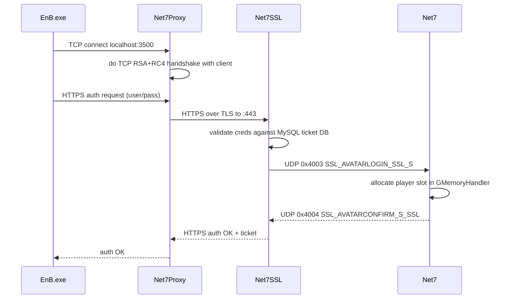
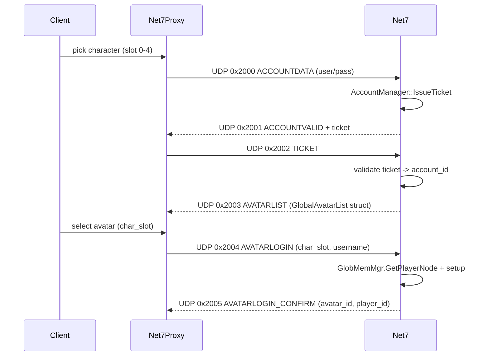
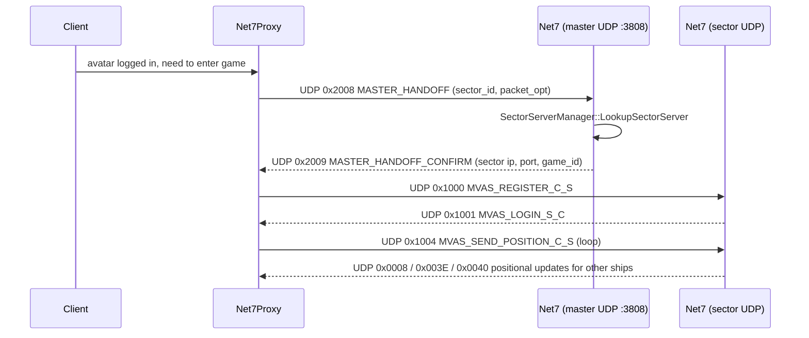

# 03 - Network protocol

This is a reference for the wire protocol the Net-7 server speaks. It is
reconstructed from the C++ source in `server/src/` plus the original
Net-7 architecture document at
`docs/reference/net7-architecture-original.rtf`. Where the source code is
the source of truth, that's noted as `path:line`. Where a detail is
unverified or reverse-engineered from the original Westwood client, that
is called out explicitly.

The fork in this repo (tada-o, svn r2974, 2010-03-15) sits halfway
through a TCP-to-UDP rewrite. Both transports compile, but only UDP is
exercised by the modern client/proxy. Read this with that history in
mind.

## Contents

1. [Transport overview](#1-transport-overview)
2. [Packet framing](#2-packet-framing)
3. [Encryption](#3-encryption)
4. [Port assignments](#4-port-assignments)
5. [Client login and sector handoff](#5-client-login-and-sector-handoff)
6. [Opcode ranges](#6-opcode-ranges)
7. [Server-to-server opcodes](#7-server-to-server-opcodes)
8. [Captured packets](#8-captured-packets)
9. [What is not in this document](#9-what-is-not-in-this-document)

---

## 1. Transport overview

There are five distinct transports in the code base:

| Transport | Where | Speakers | Status |
|---|---|---|---|
| HTTPS (TLS over TCP) | port 443 | EnB client (via Net7Proxy) <-> Net7SSL | Active |
| TCP (Westwood RSA+RC4) | ports 3801, 3805, 3501+ | Legacy direct client connection | Compiled, not used |
| TCP | port 3500 (Net7Proxy local) | EnB client <-> Net7Proxy | Active |
| UDP | ports 3806, 3808, 3809, sector dynamic | Net7Proxy <-> Net7 | Active (game) |
| UDP loopback | between Net7 and Net7SSL | Net7 <-> Net7SSL | Active (auth handoff) |
| Windows mailslot | local | Net7 <-> Net7SSL | Active (liveness pings) |

The EnB game client itself only knows TCP and HTTPS. Net7Proxy
intercepts the TCP and translates to UDP. The reason for the rewrite
(according to comments in `server/src/ServerManager.cpp:147-159`) was
to push more of the connection handling to the client side and avoid
holding hundreds of open TCP sockets on the server.

---

## 2. Packet framing

### 2.1. TCP framing (legacy + auth)

The legacy TCP header is `EnbTcpHeader`. Defined at
`server/src/PacketStructures.h:25-29`:

```c
struct EnbTcpHeader
{
    short   size;
    short   opcode;
} ATTRIB_PACKED;
```

That's it. Four bytes, little-endian. `size` includes the header
itself. `opcode` is one of the `ENB_OPCODE_*` constants. Payload
immediately follows.

The TCP receive code in `Connection::RunRecvThread`
(`server/src/Connection.cpp`) reads at least `sizeof(EnbTcpHeader)`,
inspects `size`, then reads `size - sizeof(EnbTcpHeader)` more bytes.
Standard length-prefixed framing.

### 2.2. UDP framing

The UDP header is `EnbUdpHeader`. Defined at
`server/src/PacketStructures.h:39-45`:

```c
struct EnbUdpHeader
{
    short size;
    short opcode;
    long  player_id;
    long  packet_sequence;
};
```

Note: the UDP struct deliberately does not use `ATTRIB_PACKED`. The
fields naturally pack on every supported platform (no odd-sized
fields and no internal padding), but if anyone ever inserts a
`char` in here, this will break.

`size` includes the 12-byte header. `opcode` is the same opcode
namespace as TCP. `player_id` is the server-assigned `GameID` of the
client this packet is about (0 in pre-login traffic). `packet_sequence`
is for the client-side reorder/dedup logic (see opcodes 0x2016 and
0x2017).

The maximum size enforced by `UDP_Connection::SendOpcode` is 2060
bytes (`server/src/UDPConnection.cpp:351`). Per-player send buffers
are `UDP_BUFFER_SEND_SIZE` (defined in `Player`).

### 2.3. Send and receive paths

UDP receive: `UDP_Connection::RunRecvThread`
(`server/src/UDPConnection.cpp:167-246`). One thread per
`UDP_Connection`, blocks on `recvfrom`, validates the header
(`received == bytes + sizeof(EnbUdpHeader)`), dispatches by
`m_ServerType` to one of `HandleMVASOpcode`, `HandleGlobalOpcode`,
`HandleClientOpcode`, `HandleMasterOpcode`. See section 6 for the
opcode ranges per type.

UDP send: two overloads of `UDP_Connection::SendOpcode`.
- Address-only form for pre-login: `SendOpcode(opcode, data, length, ip, port)` at `server/src/UDPConnection.cpp:341`.
- Per-player form for in-game: `SendOpcode(opcode, Player*, data, length, ip, port, seq)` at `server/src/UDPConnection.cpp:368`.

The per-player form sets `header->player_id = p->GameID()` and uses
the player-owned send buffer (so concurrent sends from worker threads
do not collide).

### 2.4. Packet sequence and resend

In-game packets include an incrementing `packet_sequence`. The client
NAKs missing packets with `0x2017 RESEND_PACKET_SEQUENCE`. The server
keeps a per-player `CircularBuffer` of recent sends in
`ServerManager::m_ReSendBuffer` (`server/src/ServerManager.h:176`).
The resend handler walks the buffer and re-sends the missing sequences.

This is a custom protocol on top of UDP, not a standard like RUDP. The
sequence space is `long`. Wraparound has not been observed.

---

## 3. Encryption

### 3.1. TCP (Westwood) handshake

Direct TCP connections do a Westwood-style RSA + RC4 handshake. The
implementation is in:

- `server/src/WestwoodRSA.cpp` / `.h` - 512-bit RSA modulus
- `server/src/WestwoodRC4.cpp` / `.h` - 64-bit-key RC4 (and a 128-bit
  variant for some channels)
- `server/src/Connection.cpp::DoKeyExchange` and `DoClientKeyExchange`

Constants in `server/src/Connection.h:15-23`:

```c
#define RC4_KEY_SIZE      8
#define RC4_UDP_KEY_SIZE  16
#define TCP_BUFFER_SIZE   (128 * 1024)
#define SEND_BUFFER_SIZE  10240
#define CONNECTION_TIMEOUT 3
#define MAX_RETRIES       5
#define MAX_TCP_BUFFER    8192
```

Two RC4 streams are kept per `Connection`: `m_CryptIn` and
`m_CryptOut`. After the RSA exchange, RC4 takes over and the rest of
the connection is RC4-encrypted, opcode by opcode. See
`server/src/Connection.h:171-172`.

The RSA modulus and the Westwood key derivation are reverse-engineered
from the original *Earth & Beyond* binary. They are not standards; do
not try to replace them with a modern handshake without keeping the
old one for compatibility.

### 3.2. UDP encryption

UDP frames in the modern client/proxy path are *not* RC4-encrypted at
the UDP level. The encryption that used to happen on TCP between the
client and the server now happens on TCP between the client and
Net7Proxy (locally on the client host). The UDP between Net7Proxy and
Net7 is cleartext. `RC4_UDP_KEY_SIZE` (16 bytes) exists in
`Connection.h` but is for a path that is not currently used in
production.

For sniffing: a tcpdump of UDP between client host and server host
will show readable opcodes and structure data.

### 3.3. HTTPS (auth)

Net7SSL uses OpenSSL. Cert files live in `server/src/local.net-7.org.cer`
and `server/src/local.net-7.org.pem` (these are dev certs; production
deployments need a real cert chain for `*.net-7.org` or whatever
domain the operator uses). The OpenSSL version pinned by the source
is 1.0 (see `server/src/openssl/`). Phase E will migrate to 3.x.

---

## 4. Port assignments

From `server/src/Net7.h:179-189`:

| Port | Macro | Transport | Speakers |
|---|---|---|---|
| 443 | `SSL_PORT` | TCP/TLS | EnB client (via proxy) <-> Net7SSL |
| 3500 | (Net7Proxy) | TCP | EnB client <-> Net7Proxy (local) |
| 3501 | `SECTOR_SERVER_PORT` | TCP (legacy) | starts here, incremented per sector |
| 3801 | `MASTER_SERVER_PORT` | TCP (legacy) | client <-> master |
| 3805 | `GLOBAL_SERVER_PORT` | TCP (legacy) | client <-> global |
| 3806 | `MVAS_LOGIN_PORT` | UDP | Net7Proxy <-> Net7 (MVAS / launcher) |
| 3807 | `SSL_LOCALCERT_LOGIN_PORT` | TCP/TLS | dev-mode auth listener (local cert) |
| 3808 | `UDP_MASTER_SERVER_PORT` | UDP | Net7Proxy <-> Net7 (master) |
| 3809 | `PROXY_SERVER_PORT` | UDP | Net7Proxy local |

There is no SRV or DNS record convention; the server's hostname and
ports are baked into the client through Net7Proxy and through the
launcher configuration.

A typical firewall rule for a production server only needs:

- TCP/443 (auth)
- UDP/3806 (MVAS)
- UDP/3808 (master)
- UDP in the dynamic range used by sectors (in standalone mode, just
  3806/3808 plus whatever sector listeners are wired up; see
  section 5)

---

## 5. Client login and sector handoff

This is the end-to-end flow of a player connecting from the EnB
client through to actually flying around in space. Each step refers
to the exact handler in source.

### 5.1. Authentication



The interesting handlers:

- `UDP_Connection::HandleSSLregister` at
  `server/src/UDP_SSLcomms.cpp:28-46` - first contact from Net7SSL.
- `UDP_Connection::HandleSSLLogin` at
  `server/src/UDP_SSLcomms.cpp:55-86` - per-avatar login. Allocates
  the player slot via `g_GlobMemMgr->GetPlayerNode(0)` and confirms
  with opcode `0x4004`.

### 5.2. Avatar list and selection

Once authenticated, the client gets its character list and picks one:



Handlers:

- `UDP_Connection::HandleGlobalOpcode` at
  `server/src/UDP_Global.cpp:43-76` - dispatcher.
- `UDP_Connection::VerifyAccountInfo` at
  `server/src/UDP_Global.cpp:78-112` - 0x2000 handler. Calls
  `g_AccountMgr->IssueTicket(username, password)`.
- `UDP_Connection::ProcessTicketInfo` at
  `server/src/UDP_Global.cpp:114-176` - 0x2002 handler. Validates
  ticket, checks banned / inactive / in-use status, sends avatar
  list.
- `UDP_Connection::SendAvatarList` at
  `server/src/UDP_Global.cpp:184-190` - builds the
  `GlobalAvatarList` from `AccountManager::BuildAvatarList` and
  sends 0x2003.
- `UDP_Connection::HandleGlobalTicketRequest` at
  `server/src/UDP_Global.cpp:192-237` - 0x2004 handler. Allocates the
  player slot, sets character slot/id, sends 0x2005.

### 5.3. Sector handoff

Sectors are separate listeners. The Master dispatch step:



Handlers:

- `UDP_Connection::HandleMasterOpcode` at
  `server/src/UDP_Master.cpp:32-44` - dispatcher.
- `UDP_Connection::ProcessHandoff` at
  `server/src/UDP_Master.cpp:46-90` - 0x2008 handler. Looks up the
  target sector via `m_ServerMgr->m_SectorServerMgr.LookupSectorServer(redirect)`,
  builds the response (ip + port + game_id), and sends 0x2009. Also
  honours a `packet_opt` byte in the request that triggers
  `Player::HandlePacketOptRequest("lac")` (a launcher hint to enable
  the proxy's packet-opt feature).
- If the player can't be found, sends `0x100A MVAS_TERMINATE_S_C` to
  tell Net7Proxy to drop the client. See line 88.

### 5.4. In-sector gameplay

Once a player is in a sector, the rest of the traffic is the bulk of
the opcode space (sections 6 and 7). The thing that ties it all
together is the per-player UDP send loop run from `PlayerManager::
RunMovementThread` every 100ms (every other 50ms tick of the main
loop).

---

## 6. Opcode ranges

The full opcode list is in `server/src/Opcodes.h`. They are grouped
by numeric range. Each range is dispatched by a different handler in
the source.

| Range | Used for | Dispatch site | Reference |
|---|---|---|---|
| `0x0000`-`0x00FF` | Client gameplay opcodes | Sector server | `Connection::HandleClientOpcode` (`Connection.cpp`), `UDP_Connection::HandleClientOpcode` |
| `0x1000`-`0x100B` | MVAS (movement assist / launcher) | Net7Proxy <-> Net7 | `UDP_Connection::HandleMVASOpcode` (`UDP_MVAS.cpp`) |
| `0x2000`-`0x2021` | Proxy <-> Server control plane | dispatched by server type | `UDP_Global.cpp`, `UDP_Master.cpp`, `UDP_Client.cpp` |
| `0x3000`-`0x3008` | Net7Proxy TCP-link lifecycle | Net7Proxy local | `Connection::ProxyClientOpcode` |
| `0x4000`-`0x4004` | Net7 <-> Net7SSL | UDP loopback | `UDP_SSLcomms.cpp` |
| `0x5000`-`0x5001` | Tracking feed | external | `UDP_Connection::HandlePlayerCountRQ` |
| `0x7801`-`0x7905` | Server-to-server (master <-> sector) | TCP between server processes | `Connection::ProcessMasterServerToSectorServerOpcode` |

### 6.1. Selected client opcodes (range 0x00xx-0x00FF)

This is the bulk of the actual game traffic. From
`server/src/Opcodes.h:23-180`. Not exhaustive; see the header for
the full set.

| Opcode | Name | Direction | Used for |
|---|---|---|---|
| `0x0000` | VERSION_REQUEST | C->S | First message on a new TCP connection |
| `0x0001` | VERSION_RESPONSE | S->C | Reply with allowed/denied + version |
| `0x0002` | LOGIN | C->S | (Legacy) login |
| `0x0003` | LOGOFF | C->S | Disconnect |
| `0x0005` | START | C->S | Begin world simulation for this client |
| `0x0006` | START_ACK | S->C | Confirm start |
| `0x0007` | REMOVE | S->C | Remove object from client view |
| `0x0008` | SIMPLE_POSITIONAL_UPDATE | both | Tight position update |
| `0x0009`-`0x000F` | OBJECT_EFFECT family | S->C | Visual effects |
| `0x0010` | DECAL | S->C | Texture/decal on hull |
| `0x0014` | MOVE | C->S | Movement input |
| `0x0017` | REQUEST_TARGET | C->S | "what is `id`?" |
| `0x0019` | SET_TARGET | C->S | Player picked a target |
| `0x001B` | AUX_DATA | S->C | Big per-object detail blob (ship stats, etc.) |
| `0x001D` | MESSAGE_STRING | S->C | Chat-line text |
| `0x001E` | GROUP | both | Group invite / accept / kick / disband |
| `0x001F` | TRADE | both | Player-to-player trade |
| `0x0029` | ITEM_STATE | both | Equipment activation state |
| `0x002C` | ACTION | both | Generic action verb |
| `0x0033` | CLIENT_CHAT | C->S | Text from chat box |
| `0x0035` | MASTER_JOIN | C->S | Request to join master server |
| `0x0036` | SERVER_REDIRECT | S->C | Reconnect here (ip+port) |
| `0x0037` | CLIENT_AVATAR | both | Avatar appearance data |
| `0x003A` | SERVER_HANDOFF | S->C | Cross-sector jump (sector text + ids) |
| `0x003E` | ADVANCED_POSITIONAL_UPDATE | both | High-detail position |
| `0x0040` | CONSTANT_POSITIONAL_UPDATE | S->C | "ship is moving straight at v" |
| `0x0042` | SERVER_PARAMETERS | S->C | Game tuning constants |
| `0x004E` | STARBASE_REQUEST | C->S | Dock at station |
| `0x0054` | TALK_TREE | S->C | NPC dialog |
| `0x0057` | SKILL_UP | C->S | Allocate skill points |
| `0x0058` | SKILL_ABILITY | C->S | Use an ability (section is `docs/05-abilities.md`) |
| `0x005D` | EQUIP_USE | C->S | Fire a weapon / activate a device |
| `0x0061` | AVATAR_DESCRIPTION | S->C | Avatar bio/text |
| `0x0064` | CLIENT_DAMAGE | S->C | Damage taken/dealt |
| `0x0066` | OPEN_INTERFACE | S->C | Open a client UI window |
| `0x006D` | GLOBAL_CONNECT | C->S | (Legacy) connect to global server |
| `0x006E` | GLOBAL_TICKET_REQUEST | C->S | (Legacy) request ticket |
| `0x006F` | GLOBAL_TICKET | S->C | (Legacy) ticket grant |
| `0x0070` | GLOBAL_AVATAR_LIST | S->C | (Legacy) avatar list |
| `0x0071` | GLOBAL_DELETE_CHARACTER | C->S | Delete avatar |
| `0x0072` | GLOBAL_CREATE_CHARACTER | C->S | Create avatar |
| `0x0079`-`0x0080` | MANUFACTURE_* | both | Crafting UI |
| `0x009B` | WARP | C->S | Begin warp |
| `0x009C` | WARP_INDEX | both | Warp destination |
| `0x009D`-`0x00A0` | STARBASE_* | both | Inside-station avatar/room movement |
| `0x00A3`-`0x00A6` | CLIENT_CHAT_* | both | Chat channels |
| `0x00B9`-`0x00BA` | LOGOFF | both | Clean logoff |
| `0x00C0`-`0x00DD` | GUILD_* | both | Guild ops |

A more readable per-opcode breakdown lives in
`docs/reference/net7-architecture-original.rtf` (the "Opcodes State"
table starting around the middle of the document). That table is
older than this code and some opcodes have moved, but it is still
the most concentrated reference for what each one *does*.

### 6.2. MVAS opcodes (range 0x10xx)

MVAS = MoVement ASsist. These are spoken between the MVASlaunch
launcher (which doubles as the per-client UDP origin) and the Net7
server.

`server/src/Opcodes.h:195-203`:

| Opcode | Name | Direction |
|---|---|---|
| `0x1000` | MVAS_REGISTER_C_S | C->S |
| `0x1001` | MVAS_LOGIN_S_C | S->C |
| `0x1004` | MVAS_SEND_POSITION_C_S | C->S |
| `0x1006` | MVAS_RESET_POSITION_S_C | S->C |
| `0x1007` | MVAS_TOGGLE_SEND_FREQ_S_C | S->C |
| `0x1008` | MVAS_LOGOFF_C_S | C->S |
| `0x1009` | MVAS_BAD_LOGIN_S_C | S->C |
| `0x100A` | MVAS_TERMINATE_S_C | S->C |
| `0x100B` | MVAS_PRE_START_S_C | S->C |

Handlers are in `server/src/UDP_MVAS.cpp`. The
`UDP_Connection::HandleMoveAssistRegister` member is declared at
`server/src/UDPConnection.h:86` and corresponds to opcode `0x1000`.

### 6.3. Proxy/Server control opcodes (range 0x20xx)

These are the auth / handoff opcodes covered in section 5. From
`server/src/Opcodes.h:206-237`:

| Opcode | Name | Direction | Section |
|---|---|---|---|
| `0x2000` | ACCOUNTDATA | C->S | 5.2 |
| `0x2001` | ACCOUNTVALID | S->C | 5.2 |
| `0x2002` | TICKET | C->S | 5.2 |
| `0x2003` | AVATARLIST | S->C | 5.2 |
| `0x2004` | AVATARLOGIN | C->S | 5.2 |
| `0x2005` | AVATARLOGIN_CONFIRM | S->C | 5.2 |
| `0x2006` | SECTOR_VALIDATE | S->S | sector activation |
| `0x2007` | SECTOR_VALID_CONFIRM | S->S | sector activation |
| `0x2008` | MASTER_HANDOFF | C->S | 5.3 |
| `0x2009` | MASTER_HANDOFF_CONFIRM | S->C | 5.3 |
| `0x200A` | CLIENT_OPCODE | both | "forward this dumb to the sector connection" - tunneling |
| `0x200B` | CREATE_AVATAR | C->S | character creation |
| `0x200C` | CREATE_DELETE_AVATAR_CONFIRM | S->C | character ack |
| `0x200D` | DELETE_AVATAR | C->S | character deletion |
| `0x200E` | GLOBAL_ERROR | S->C | error code response |
| `0x200F` | COMM_PORT | both | comm channel join |
| `0x2010` | SET_GLOBAL_LOGIN_LINK / DATA_FILE | both | overlapping reuse (see code) |
| `0x2011` | SET_PROXY_SECTOR_LINK / GALAXY_MAP_CACHE | both | overlapping reuse |
| `0x2012` | START_PROSPECT | C->S | prospecting begins |
| `0x2013` | TRACTOR_ORE | C->S | tractor beam |
| `0x2014` | LOOT_ITEM | C->S | loot |
| `0x2015` | STARBASE_AVATAR | both | docked-avatar appearance |
| `0x2016` | PACKET_SEQUENCE | S->C | sequence ack |
| `0x2017` | RESEND_PACKET_SEQUENCE | C->S | resend NAK |
| `0x2018` | STATIC_OBJECT_CREATE | S->C | static prop |
| `0x2019` | RESOURCE_OBJECT_CREATE | S->C | asteroid/resource |
| `0x201A` | PACKET_C_SEQUENCE | C->S | client sequence ack |
| `0x2020` | LOGIN_STAGE_S_C | S->C | login progress message |
| `0x2021` | LOGIN_STAGE_ACK_C_S | C->S | progress ack |

Note the two `0x2010` and two `0x2011` definitions: the codebase has
overlapping macros that get differentiated by context (which server
is being talked to). This is a known wart.

### 6.4. Net7Proxy TCP-link opcodes (range 0x30xx)

`server/src/Opcodes.h:240-248`. These coordinate the legacy TCP login
link that Net7Proxy still maintains in parallel with the UDP path.

| Opcode | Name | Notes |
|---|---|---|
| `0x3000` | WAIT_AUX | "do you have my aux packets?" |
| `0x3001` | AUX_RESPONSE | "yes / re-send these" |
| `0x3002` | TCP_LOGIN_VALIDATE | new TCP link, who owns it |
| `0x3003` | TCP_LOGIN_CLOSE | tear down login link |
| `0x3004` | PLAYER_SHIP_SENT | ship data flushed |
| `0x3005` | PLAYER_COMMS_ALIVE | keepalive |
| `0x3006` | PLAYER_LOGIN_FAILED | abort |
| `0x3007` | PLAYER_LOGIN_FAILED_CONFIRM | (typo in source: ENB_OPCODE_3006_PLAYER_LOGIN_FAILED_CONFIRM = 0x3007) |
| `0x3008` | STARBASE_LOGIN_COMPLETE | dock OK |

### 6.5. SSL channel (range 0x40xx)

`server/src/Opcodes.h:251-255`. Already covered in section 5.1.

### 6.6. Tracking / status feed (range 0x50xx)

`server/src/Opcodes.h:258-259`. Plain "how many players are on"
feed. Used by external dashboards. Handler:
`UDP_Connection::HandlePlayerCountRQ` at
`server/src/UDP_SSLcomms.cpp:88-104`.

---

## 7. Server-to-server opcodes

These are sent over TCP between distinct Net7 processes when running
in distributed mode. They are the same wire format
(`EnbTcpHeader` + payload, RC4-encrypted) as legacy client-server TCP.

`server/src/Opcodes.h:182-189`:

| Opcode | Name | Direction |
|---|---|---|
| `0x7801` | SECTOR_ASSIGNMENT | Master -> Sector |
| `0x7802` | REQUEST_CHARACTER_DATA | Sector -> Master |
| `0x7803` | SECTOR_SHUTDOWN | Master -> Sector |
| `0x7804` | CHAT_MESSAGE | both |
| `0x7805` | WHERE_IS_PLAYER | Sector -> Master |
| `0x7902` | CHARACTER_DATA | Master -> Sector |
| `0x7905` | PLAYER_LOCATION | Master -> Sector |

In standalone mode none of these are sent on the wire; the calls are
in-process. The handlers still exist
(`Connection::HandleSectorServerAssignment` at
`server/src/Connection.h:118`, etc).

---

## 8. Captured packets

The kyp snapshot includes three packet captures from the original
Net-7 emulator. They are not protocol documentation but they are the
closest thing to ground truth for what the client expects.

`archive/kyp-snapshot/capturedPackets/`:

- `capture_1.rar`
- `capture_2.rar`
- `capture_3.rar`

These are `.rar` archives. They appear to be raw packet dumps
(format and tool unverified - probably from an EnB-specific sniffer
shipped with the kyp dev workspace; the `Documents/` directory next
to them references "PacketCapture" tooling but the exact format is
unknown from code reading and the captures have not been opened in
this work).

If you are working on a new opcode handler, opening these captures and
comparing them against `Opcodes.h` is the closest thing to authoritative
protocol documentation that survives.

---

## 9. What is not in this document

The following details are deliberately omitted because they are not
recoverable from code reading alone:

- **Per-opcode payload schemas.** Many of the C struct definitions
  in `server/src/PacketStructures.h` (`AvatarData`, `ShipData`,
  `ServerRedirect`, `MasterJoin`, `GlobalTicket`, etc.) are
  documented inline with field-by-field byte offsets and comments,
  and those serve as the reference for the opcodes that use them.
  But many opcodes ad-hoc serialise their payload via
  `ExtractLong` / `ExtractDataLS` / `AddData` from
  `server/src/PacketMethods.h`, and the only way to know the exact
  layout is to read the producer and consumer code side by side.
  Future work item: extract the implicit schema for each opcode and
  put it in a per-opcode table.
- **Westwood RSA key exchange details.** The math is implemented in
  `server/src/WestwoodRSA.cpp` but it is reverse-engineered from the
  original Westwood binary. A description of the key derivation would
  need to come from the original protocol RE notes that the Net-7
  team kept and which were not included in the source dump.
- **Net7Proxy's translation rules.** Net7Proxy lives in `proxy/`; it
  is the one piece that knows how to take a TCP `EnbTcpHeader` from
  the client and re-emit it as `EnbUdpHeader` plus envelope opcodes
  to Net7. The translation table is in the proxy source, not here.
  See `proxy/` for that side.
- **Opcode obsolescence.** The 0x7802 etc. server-to-server opcodes
  are documented in the comment block at the end of `Connection.h`
  but are mostly unused in standalone mode. Distributed mode is not
  tested in the current build.
- **Galaxy map and patch download protocol.** The `0x0097`
  GALAXY_MAP / `0x0098` GALAXY_MAP_REQUEST opcodes are part of a
  patcher-served data flow that is delegated to the EnB patcher
  (Westwood's update tool) and Net7Proxy. The server side just
  acknowledges the request; the actual data is served by the
  patcher (HTTPS / static file). See `Connection.h:17` for the
  "not used anymore for anything. Galaxy map is stored locally and
  we update it via the patcher" note.

Unknown from code reading; would need protocol capture analysis or
original Net-7 team notes:

- Exact RC4 key derivation seed values
- Whether `packet_sequence` rolls over and how
- Per-opcode minimum/maximum payload sizes
- The semantics of the second `0x2010` and `0x2011` macros (overlapping
  reuse depending on call site)
