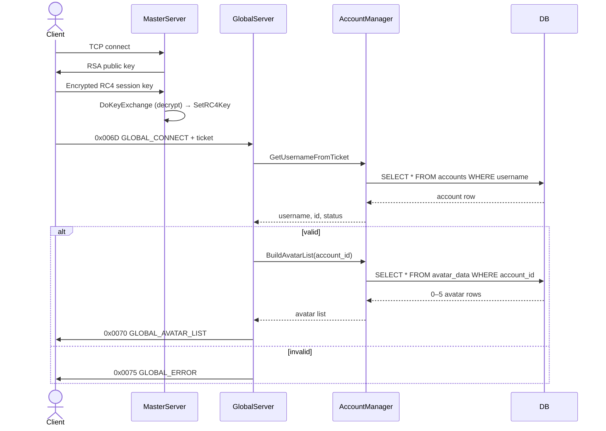
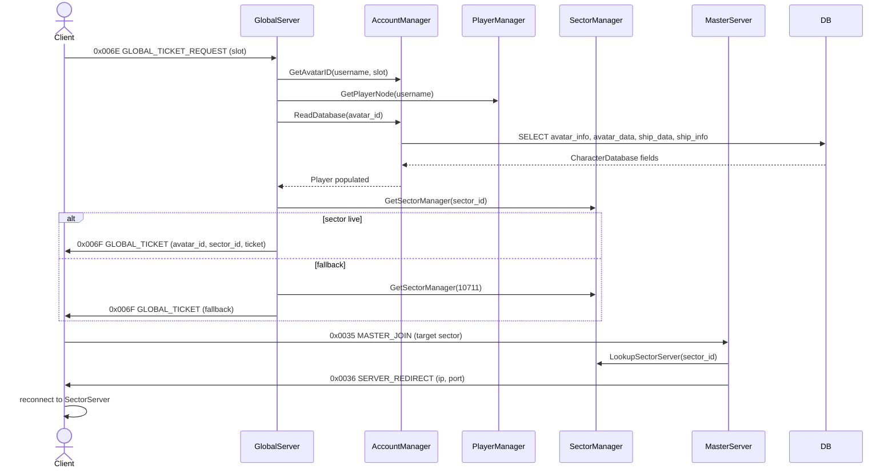
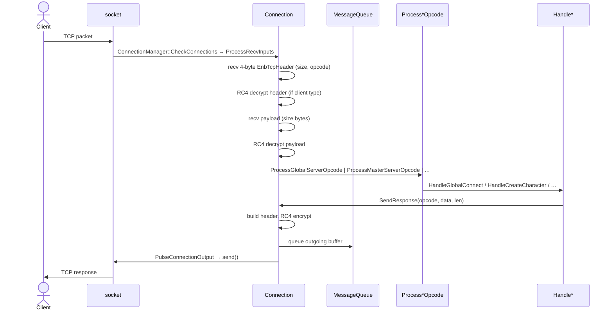

# 04 - Server modules

This is the per-module reference for the C++ server in `server/src/`.
Each section describes one top-level manager class: what it owns, what
the interesting entry points are, and where in the source the contract
lives. Modules are roughly grouped by layer.

Conventions:

- `path:line` references point to the current (tada-o r2974) source.
- "Reference" lines are header files unless stated otherwise.
- The `g_` prefix means a global pointer declared in `server/src/Net7.h`
  (lines 261-268). The pattern is "one instance per process, owned by
  `ServerManager`, exposed globally for terse access".

## Contents

1. [Process-level managers](#1-process-level-managers)
   - [ServerManager](#11-servermanager)
   - [SectorServerManager](#13-sectorservermanager)
   - [MailManager](#14-mailmanager)
   - [SaveManager](#15-savemanager)
   - [StringManager / GMemoryHandler](#16-stringmanager--gmemoryhandler)
2. [Sector-level managers](#2-sector-level-managers)
   - [SectorManager](#21-sectormanager)
   - [ObjectManager](#22-objectmanager)
3. [Players, mobs and combat](#3-players-mobs-and-combat)
   - [PlayerManager](#31-playermanager)
   - [Player and the PlayerXxx files](#32-player-and-the-playerxxx-files)
   - [CMob, MOB, MOBSpawn](#33-cmob-mob-mobspawn)
   - [CMobBuffs](#34-cmobbuffs)
   - [Equipable (CMobEquippable.h)](#35-equipable-cmobequippableh)
4. [Accounts and persistence](#4-accounts-and-persistence)
   - [AccountManager](#41-accountmanager)
5. [Groups and guilds](#5-groups-and-guilds)
   - [Groups (in PlayerManager)](#51-groups-in-playermanager)
   - [GuildManager and the Guild structs](#52-guildmanager-and-the-guild-structs)
6. [Content / data managers (SQL loaders)](#6-content--data-managers-sql-loaders)
   - [ItemBaseManager](#61-itembasemanager)
   - [AssetContent / AssetDatabaseSQL](#62-assetcontent--assetdatabasesql)
   - [BuffContent / BuffDatabaseSQL](#63-buffcontent--buffdatabasesql)
   - [Factions / FactionDataSQL](#64-factions--factiondatasql)
   - [MOBContent / MOBDatabaseSQL](#65-mobcontent--mobdatabasesql)
   - [Other content loaders](#66-other-content-loaders)
7. [Network](#7-network)
   - [UDP_Connection](#71-udp_connection)
   - [Deleted in Phase Q (TCP cluster + EffectManager)](#72-deleted-in-phase-q-tcp-cluster--effectmanager)

> **Phase Q deletions** (2026-05-23). The TCP cluster
> (`Connection`, `ConnectionManager`, `TcpListener`,
> `SSL_Listener`, `SSL_Connection`, `ClientTo{Master,Global,Sector}Server`),
> `EffectManager`, and `JobManager_DEP_` were removed from
> `server/src/`. The previous §1.2 ConnectionManager, §2.3
> EffectManager, §7.2 Connection (TCP), and §7.3 SSL_Listener /
> SSL_Connection sections were deleted from this doc to match. See
> `plans/17-phase-q-kyp-cluster-deletion.md` for the rationale.

---

## 1. Process-level managers

### 1.1. ServerManager

**Header**: `server/src/ServerManager.h:52-183`
**Implementation**: `server/src/ServerManager.cpp` (1013 lines)
**Global**: `g_ServerMgr` (`server/src/Net7.h:261`)

The root object. Constructed in `main()` at
`server/src/Net7.cpp:381`. Owns essentially every other manager - many
as direct members, some as pointers.

Public modes:

```c
ServerManager(bool is_sector_server, unsigned long ip_address,
              short port, short max_sectors, bool standalone,
              unsigned long internal_ip_address = 0);
```

Entry points:

| Method | Purpose | Reference |
|---|---|---|
| `RunServer` | branches on `m_IsMasterServer` / `m_IsStandaloneServer` | `ServerManager.cpp:122` |
| `RunMasterServer` | master loop (auth, global, sector dispatch, all sectors) | `ServerManager.cpp:136` |
| `RunSectorServer` | sector-only mode | `ServerManager.cpp:281` |
| `MainLoop` | 50ms-tick polling loop | `ServerManager.cpp:439` |
| `ServerCheck` | one tick of work (mailslots, movement, SSL watchdog) | `ServerManager.cpp:339` |
| `SetupSectorServer` | activate a sector by id | `ServerManager.cpp:547` |
| `SetSectorServerReady` | mark a sector ready, hand back its port | (in cpp) |
| `ReloadAllObjects` / `ReloadSectorObjects` | content hot-reload | `ServerManager.cpp:470` / `:486` |
| `GetSectorManager(short port)` / `GetSectorManager(long sector_id)` | sector lookup | (in cpp) |
| `GetNextEffectID` | server-wide unique effect id allocator | `ServerManager.cpp:270` |

Members of note (`ServerManager.h:121-181`):

- `m_AccountMgr` (pointer) - section 4.1
- `m_PlayerMgr` (value) - section 3.1
- `m_ItemBaseMgr` (value) - section 6.1
- `m_MOBList`, `m_AssetList`, `m_BuffData`, `m_FactionData`,
  `m_SkillsList`, `m_SectorContent`, `m_CBassetList` - content
  loaders
- `m_SectorMgrList[MAX_SECTORS]` - per-sector managers, lazily filled
- `m_SectorServerMgr` (value) - section 1.3
- `m_UDPConnection`, `m_UDPMasterConnection` - section 7.1
- `m_GlobMemMgr`, `m_StringMgr`, `m_SaveMgr`, `m_JobMgr`

Threading: most members are touched from many threads. `m_Mutex`
guards the file-timer fields. Per-manager mutexes guard the rest.

### 1.3. SectorServerManager

**Header**: `server/src/SectorServerManager.h`
**Implementation**: `server/src/SectorServerManager.cpp`

Galaxy-level sector dispatch. The Master Server uses this to answer
"client wants sector N - which ip/port hosts it?".

Methods used elsewhere:

- `SectorLockdown()` - prevents new sector registrations
- `CheckConnections()` - returns true when every sector that needs to
  be live is live; called from `ServerCheck`
- `LookupSectorServer(ServerRedirect &)` - fill in ip/port for a
  requested sector_id, called from `UDP_Connection::ProcessHandoff`
  at `server/src/UDP_Master.cpp:61`

In standalone mode, the lookup resolves to the same process so the
"redirect" is effectively a NOP and the client just keeps talking
on the same UDP socket.

### 1.4. MailManager (AF_UNIX IPC)

**Header**: `server/src/MailslotManager.h:25-46`
**Implementation**: `server/src/MailslotManager.cpp` (211 lines)
**Global**: `g_MailMgr` (`server/src/Net7.h:268`)

Local IPC layer between the server and the login process. The class
keeps its historical name for source-history continuity; the
transport, post-Phase M (2026-05-23), is an **AF_UNIX SOCK_DGRAM**
socket pair under `/run/net7-ipc/`. The wrapper is
`net7ipc::PosixIpc` in `common/include/net7/PosixIpc.h`.

Allocated in `RunMasterServer` at `server/src/ServerManager.cpp:163`.

Public surface (`MailslotManager.h:31-35`):

```c
bool WriteMessage(char *message);
void CheckMessages();
void HandleMessage(short opcode, short slot, short bytes);
void HandleMessage();
void ResetMailSystem();
```

The opcode set is two values, both declared in `MailslotManager.h:47-48`:

- `LOCAL_PING_SSL_SERVER  0x04` (login -> server liveness)
- `LOCAL_PING_SERVER_SSL  0x05` (server -> login liveness)

`CheckMessages` is polled from `ServerManager::ServerCheck` every
50ms. Liveness gap > 60s triggers `RelaunchNet7SSL` at
`server/src/ServerManager.cpp:366-374`.

### 1.5. SaveManager

**Header**: `server/src/SaveManager.h`
**Implementation**: `server/src/SaveManager.cpp`
**Global**: `g_SaveMgr` (`server/src/Net7.h:267`)

Background thread that persists dirty `Player` and other dirty
objects to MySQL. Constructed in `ServerManager`'s ctor; destroyed
first in the dtor (`ServerManager.cpp:108`) so saves drain before
the rest of the process tears down.

The save thread is the reason for the 5-second `usleep` at the end of
`MainLoop` (`ServerManager.cpp:467`) - that's the "let the save
thread finish" path that the in-source TODO calls out as needing real
event-based shutdown. (Phase M replaced the original `Sleep` call.)

### 1.6. StringManager / GMemoryHandler

`StringManager` (`server/src/StringManager.h`, global `g_StringMgr`)
is a string interning / lookup pool used for short strings that get
sent many times (chat channel names, faction names, etc.). It cuts
allocation pressure in the hot path. Most consumers do
`g_StringMgr->GetStr(...)`.

`GMemoryHandler` (`server/src/MemoryHandler.h`, global `g_GlobMemMgr`)
is the player slot pool. It holds up to `MAX_ONLINE_PLAYERS` (500;
defined at `server/src/PlayerManager.h:23`) `Player` objects in a
fixed array. `GetPlayerNode(name_or_null)` allocates a slot;
`GetPlayerCount` returns the current usage. Allocation here is what
binds an authenticated user to a runtime `Player` instance - see
`UDP_Connection::HandleSSLLogin` at
`server/src/UDP_SSLcomms.cpp:72`.

---

## 2. Sector-level managers

### 2.1. SectorManager

**Header**: `server/src/SectorManager.h`
**Implementation**: `server/src/SectorManager.cpp`

One instance per sector. Owns the per-sector thread and the per-sector
`ObjectManager`.

Key methods (declarations in header):

| Method | Purpose |
|---|---|
| `StartListener(short port)` | bind UDP listener for this sector (distributed mode) |
| `SetBoundaries(int index)` | set up sector spatial bounds |
| `SetSectorNumber(long sector_id)` | tag this sector with its id |
| `SetIPAddr(unsigned long)` | set the IP advertised in redirect responses |
| `BeginSectorThread()` | spawn this sector's worker |
| `GetObjectManager()` | hand back the per-sector ObjectManager |

Sector threads run a tight loop that:
1. Calls `ObjectManager::PerformObjectAdmin` (mob updates, respawns,
   cleanup).
2. Steps every MOB / Spawn / Husk / Hulk / Object via their
   `UpdateObject(current_tick)` method.
3. Flushes pending UDP sends for players currently in the sector.

The handoff into the sector thread is in `ServerCheck` at
`server/src/ServerManager.cpp:359-363`.

### 2.2. ObjectManager

**Header**: `server/src/ObjectManager.h:49-120+`
**Implementation**: `server/src/ObjectManager.cpp`

Per-sector registry of every dynamic object in space. Owns the object
ids and the spatial lists. The header at `ObjectManager.h:49`:

```c
class ObjectManager
{
public:
    void        DeleteAllObjects();
    Object    * AddNewObject(object_type, bool static_obj = false);
    Object    * GetObjectFromID(long object_id);
    Object    * GetObjectFromName(char *object_name); // slow, avoid in loop
    Object    * FindStation(short station_number);
    Object    * FindGate(long gate_id);
    Object    * FindGate(); // random
    Object    * FindFirstNav();
    Object    * NearestNav(float *position);
    Object    * FindPlanet();
    void        SetLockdown(bool lockdown);
    void        DestroyObject(Object *, long time_to_destroy, long duration);
    void        SendAllNavs(Player *);
    void        SendRemainingStaticObjs(Player *);
    void        MakeDecosClickable(Player *);
    void        SpawnRandomMOB(float *position);
    void        SpawnSpecificMOB(float *position, short mob_type, short level);
    void        SendObject(Player *, Object *);
    void        SendPosition(Player *, Object *);
    void        SetSectorManager(SectorManager *);
    void        RemovePlayerFromMOBRangeLists(Player *);
    void        DisplayDynamicObjects(Player *, bool all_objects = false);
    void        PerformObjectAdmin();
    void        InitialiseResourceContent();
    void        SectorSetup();
    long        GetAvailableSectorID();
    u32       * GetSectorList();
    bool        CheckNavRanges(Player *);
    void        Explored(Player *, Object *);
    ObjectList *GetMOBList();
    void        SetSectorID(long sector_id);
    void        SetObjectsAtRange(Player *, float range, long *rangelist, long *rangelist2 = 0);
    Object    * GetFieldAsteroid(Object *, long index);
    Object    * GetMobFromSpawn(Object *, long index);
    void        RemoveField(Object *);
    void        CalcNewPosition(Object *, unsigned long current_time);
    // ...
};
```

Object types it handles include `MOB`, `MOBSpawn`, `Husk`, `Hulk`,
`Field`, `Resource`, `Planet`, `StarBase`, `StarGate`, `NavType`. See
the `#include` block at the top of `ObjectManager.h:25-34`.

`AddNewObject(object_type, static_obj)` allocates the right subclass
and assigns a `GameID`. Static objects (gates, planets, stations) get
deterministic ids from `AssignStaticID`; dynamic objects get ids from
`GetNewGameID`.

The two `_DEFAULT_TEMP_OBJLIST_SIZE = 200_` slot count
(`ObjectManager.h:44`) is the per-sector reserve of temporary object
slots, used for things like loot containers that come and go.

### 2.3. EffectManager (deleted in Phase Q)

Originally lived at `server/src/EffectManager.{h,cpp}` and maintained
a global list of in-flight visual effects keyed by a `Connection*`
pointer. The class never made the cut to the per-sector model and was
TCP-bound through that `Connection*` pointer; once Phase Q removed the
TCP cluster it had nothing left to point at. Deleted 2026-05-23 along
with the rest of the cluster. Visual-effect bookkeeping today happens
inside `ObjectManager` via per-object and per-player visibility lists.

---

## 3. Players, mobs and combat

### 3.1. PlayerManager

**Header**: `server/src/PlayerManager.h:57-218`
**Implementation**: `server/src/PlayerManager.cpp` (1307 lines)
**Global**: `g_PlayerMgr` (`server/src/Net7.h:263`)

One instance per process. Manages every online player across every
sector, plus groups and guilds.

Constants:
- `MAX_ONLINE_PLAYERS = 500` (`PlayerManager.h:23`)

Functional categories:

**Movement and update**:
```c
void RunMovementThread(void);
void RunPlayerUpdate(Player *p);
void RunLoginThread(void);
void TerminateAllPlayers(void);
void SendUDPOpcodes(void);
void SendUDPPlayerOpcodes(Player *p);
```
`RunMovementThread` is called from `ServerCheck` every other tick, so
~10 Hz. It iterates active players and runs per-player updates.

**Chat**:
```c
void ChatSendEveryone(...);
void BroadcastChat(...);
void LocalChat(...);
void ChatSendPrivate(...);
void ChatSendChannel(...);
void SendGlobalVaMessage(...);
void GMMessage(char *);
void ErrorBroadcast(char *, ...);
void GlobalMessage(char *);
void GlobalAdminMessage(char *);
```
Multiple "send to" topologies: everyone in the galaxy, everyone in the
sector, just a player, a chat channel, just GMs.

**Player lifecycle**:
```c
void RemovePlayer(Player *);
void SetSector(Player *, long sector_id);
bool SetupPlayer(Player *, long IPaddr);
bool CheckAccountInUse(char *username);
void DropPlayerFromSector(Player *);
void DropPlayerFromGalaxy(Player *);
```

`SetupPlayer` is the post-auth init - called from
`UDP_Connection::HandleGlobalTicketRequest`
(`server/src/UDP_Global.cpp:218`).

**Lookup**:
```c
Player *GetPlayer(long GameID, bool sector_login = false);
Player *GetPlayer(char *Name);
long    GetGameIDFromName(char *Name);
Player *GetPlayerFromCharacterID(long CharacterID);
Player *GetPlayerFromIndex(long index, bool sector_login = false);
```

Backed by `m_PlayerLookup` (`std::map<unsigned long, unsigned long>`)
and `m_GlobalPlayerList` (bitset of `MAX_ONLINE_PLAYERS / 32 + 1`
words) for iteration.

**Groups and guilds** - see sections 5.1 and 5.2.

State (`PlayerManager.h:205-217`):

```c
Group         * m_GroupList;
GuildList       m_GuildList;
long            m_NextGroup;
int             m_NextGuild;
int             m_NextPendingGuild;
Mutex           m_Mutex;
bool            m_Movement_thread_running;
u32             m_GlobalPlayerList[MAX_ONLINE_PLAYERS/32 + 1];
UDP_Connection *m_UDPConnection;
GMemoryHandler *m_GlobMemMgr;
PlayerIDMap     m_PlayerLookup;
u32             m_last_group_tick;
```

### 3.2. Player and the PlayerXxx files

**Header**: `server/src/PlayerClass.h`
**Implementations**: split across several files for compile-time
manageability.

`Player` derives from `CMob` (and through it `Object`). One instance
per online avatar. Its implementation is split:

| File | Aspect |
|---|---|
| `server/src/PlayerClass.cpp` | core ctor/dtor and lookups |
| `server/src/PlayerConnection.cpp` | TCP/UDP connection state |
| `server/src/PlayerCombat.cpp` | damage, weapons, kills |
| `server/src/PlayerInventory.cpp` | inventory ops |
| `server/src/PlayerExperience.cpp` | XP, level-up |
| `server/src/PlayerSkills.cpp` | skill points, ability points |
| `server/src/PlayerAbilitys.cpp` | ability use (sic - retained spelling) |
| `server/src/PlayerSaves.cpp` | persistence calls |
| `server/src/PlayerMisc.cpp` | grab bag |
| `server/src/PlayerMissions.cpp` | mission state |
| `server/src/PlayerGuild.cpp` | guild membership |
| `server/src/PlayerManufacturing.cpp` | crafting |
| `server/src/PlayerShip.h` | ship config |

There is no separate `PlayerCombat` class; combat methods live on
`Player`. Treat `PlayerCombat.cpp` as a section of the Player
implementation, not a stand-alone module.

`Player::SetupAbilities` is inherited from `CMob` (section 3.3) and
populates `m_AbilityList[]` for every ability the player has unlocked.

Key Player methods accessed by other modules:

- `GameID()` - the runtime, per-session, per-sector unique id used
  in packets
- `CharacterID()` - the database id (stable across sessions)
- `SetCharacterID`, `SetCharacterSlot`, `SetGameID`,
  `SetAccountUsername`, `SetPlayerPortIP` - set during login by
  `UDP_Connection::HandleGlobalTicketRequest` / `HandleSSLLogin`
- `Database()` - pointer to the in-memory `CharacterDatabase` slot
- `GetUDPBuffer()` - per-player send buffer for `UDP_Connection::SendOpcode`
- `HandlePacketOptRequest(char *)` - net7proxy packet-opt mode toggle

### 3.3. CMob, MOB, MOBSpawn

**Headers**:
- `server/src/ObjectClass.h` - `Object` base
- `server/src/CMobClass.h:75-176` - `CMob` (the things that can be in
  combat)
- `server/src/MOBClass.h:79-300+` - `MOB` (NPC)
- `server/src/MOBSpawnClass.h` - `MOBSpawn` (spawner)

Class hierarchy:

```
Object  (base for everything in space)
  +-- CMob  (anything with shield/hull/abilities)
  |     +-- MOB     (NPC)
  |     +-- Player  (the avatar)
  +-- Husk          (loot container)
  +-- Hulk          (destroyed ship visual)
  +-- MOBSpawn      (spawn point, spawns MOBs)
  +-- StarBase, StarGate, Planet, NavType, Field, Resource (static-ish)
```

`CMob` is intentionally the common base so MOBs can cast abilities on
players and vice versa. The interesting members
(`CMobClass.h:161-176`):

```c
protected:
    u32           m_ClickedList[MAX_ONLINE_PLAYERS/32 + 1];
    unsigned long m_LastShieldChange;
    unsigned long m_ShieldRecharge;
    AbilityBase  *m_CurrentSkill;
    AbilityBase  *m_AbilityList[MAX_ABILITY_IDS];   // 138 slots
    AbilityBase  *m_CombatTrance;
    DamageShield *m_ShieldListHead;
    int           m_StealthLevel;
public:
    Stats     m_Stats;
    CMobBuffs m_Buffs;
```

Key methods on `CMob` (`CMobClass.h:84-160`):

- `GetShield`, `RemoveShield`, `ShieldUpdate`, `RechargeShield`,
  `RecalculateShieldRegen`
- `RemoveHull(float, CMob *enemy)` - virtual, MOB/Player provide
  implementations
- `CommonDamageHandling` - damage entry point
- `SetupAbilities` / `DeleteAbilities` / `ResetAbilities` - ability
  table lifecycle (see `docs/05-abilities.md`)
- `AddDamageShield` / `RemoveDamageShield` / `FindDamageShield` /
  `ClearDamageShields` - damage shield list management
- `IsClickedBy(Player *)` / `SetClickedBy(Player *)` -
  per-player click tracking
- A long list of `virtual` placeholders that real subclasses
  override: `Menace`, `Hack`, `Befriend`, `Taunt`, `SetHalfSpeed`,
  `SetIsCloaked`, `SelfDestruct`, `RechargeReactor`, etc.

`MOB` adds (`MOBClass.h:79-300`):

- `MOB_TYPE` enum: ROBOTIC / MANNED / ORGANIC_RED / ORGANIC_GREEN /
  CRYSTALLINE / ENERGY / ROCK_BASED. Used for loot type and to
  determine "is organic" for abilities like BioRepression that only
  affect organics.
- `MOB_Behaviour` enum: INVALID, PATROL_FIELD, PATROL_NAV,
  PATROL_POSITION, NAV_ROUTE, HUNT, CLUSTER, CURIOUS, DRIFT, PURSUE,
  TURRET, TURRET_ATTACK, MENACE.
- `Hate_Info` / `Damage_Info` lists (HATE_SIZE=6, DAMAGE_SIZE=12)
  for threat tables.
- AI methods: `ChooseTarget`, `LockTarget`, `HandleAttack`,
  `FireWeapon`, `UseSkill`, `AddHate`/`SubtractHate`,
  `GetMaxHateID`, `LockTurretTarget`, `CheckAggro`,
  `CheckWarningShots`, `Menace`, `Hack`, `Befriend`, `Taunt`.
- Spawning: `OnRespawn`, `Remove`, `DestroyMOB`.
- Visibility: `UpdateObjectVisibilityList`, `AddObjectToRangeList`,
  `RemoveObjectFromRangeList`, `RemovePlayerFromRangeLists`.

`MOBSpawn` (`server/src/MOBSpawnClass.h`) is a stationary object that
holds the data for spawning one or more MOBs at intervals. It is
populated from the `npc` / `spawn` content tables.

### 3.4. CMobBuffs

**Header**: `server/src/CMobBuffs.h`
**Implementation**: `server/src/CMobBuffs.cpp`

Per-CMob buff state. Held as a value member at `CMobClass.h:175`.
Holds the currently-active buff effects on a CMob (player or mob),
tracks expiration, and applies / removes stat modifiers when buffs
come and go.

Buff *definitions* (the static catalogue of every buff that exists)
live in `BuffContent` (section 6.3). `CMobBuffs` is the per-instance
runtime state.

### 3.5. Equipable (CMobEquippable.h)

**Header**: `server/src/CMobEquippable.h:23-155`
**Implementation**: `server/src/CMobEquippable.cpp` / `server/src/Equipable.cpp`

Per-equipment-slot state on a player or MOB ship. The file is named
`CMobEquippable.h` but the class is `Equipable` (one `p`).

```c
typedef enum
{
    EQUIP_SHIELD,
    EQUIP_REACTOR,
    EQUIP_ENGINE,
    EQUIP_WEAPON,
    EQUIP_DEVICE
} EquipType;
```

(`CMobEquippable.h:11-18`)

Public methods (`CMobEquippable.h:25-79`):

- `Init(Player *, slot)`
- `CanEquip(_Item *)` / `Equip(_Item *, delay)` / `EquipAmmo(_Item *)`
- `Install(unsigned long)` / `FinishInstall(Player *, slot)`
- `Hack(unsigned long)` - target of a hacking ability
- `ManualActivate()` / `CheckAutoActivate()`
- `ShootAmmo(int Target, unsigned int quantity)`
- `UpdateRange(...)` - two overloads, one with a long list of
  range-buff multiplier/value pairs
- `CancelAutofire()` / `CoolDown()`
- `ItemReady()` / `ItemInstalled()`
- `Lock()` / `Unlock()` - explicit mutex API

Each equipped item has its own `Mutex` (`CMobEquippable.h:154`). The
private `_Method` variants (e.g. `_Equip`, `_ManualActivate`,
`_ShootAmmo`) are the non-locking implementations called from inside
already-locked critical sections.

Stat application uses a `m_StatIDs[MAX_EQUIP_STATS]` array
(MAX_EQUIP_STATS=60) so that on un-equip the exact stat IDs the item
added can be removed - this is the "exit the buff cleanly" pattern.

---

## 4. Accounts and persistence

### 4.1. AccountManager

**Header**: `server/src/AccountManager.h:52-131`
**Implementation**: `server/src/AccountManager.cpp` (1272 lines)
**Global**: `g_AccountMgr` (`server/src/Net7.h:266`)

Master-server-only. Constructed in the `ServerManager` ctor when
`m_IsMasterServer || m_IsStandaloneServer`.

Constants (`AccountManager.h:27-28`):
- `MAX_ACCOUNTS = 1024` (for in-memory mode; SQL mode is unbounded)
- `TICKET_EXPIRE_TIME = 300000` (5 minutes in ms)

ID arithmetic (`AccountManager.h:47-50`):

```c
#define AVATAR_ID(account_id, slot)  (account_id * 5 + slot + 1)
#define ACCOUNT_ID(avatar_id)        (avatar_id - 1) / 5
```

So account 1 has avatars 1-5, account 2 has avatars 6-10, etc. Five
character slots per account.

Public surface (`AccountManager.h:59-78`):

```c
char * IssueTicket(char *username, char *password);
char * GetUsernameFromTicket(char *ticket);
bool   GetEmailAddress(char *username, char *buffer, int buflen);
long   GetAccountID(char *username);
long   GetAvatarID(char *username, int slot);
bool   SetAccountStatus(char *username, long status);
long   GetAccountStatus(char *username);
bool   ChangePassword(char *username, char *password);
bool   AddUser(char *username, char *password, char *access);
long   CreateCharacter(GlobalCreateCharacter *create);
void   DeleteCharacter(long avatar_id);
bool   SaveDatabase(CharacterDatabase *database, long avatar_id);
bool   ReadDatabase(CharacterDatabase *database, long avatar_id);
void   BuildAvatarList(GlobalAvatarList *list, long account_id);
```

Account statuses (`AccountManager.h:110`):
0=Player, 10=donor, 20=Helper, 30=Beta Tester, 50=GM, 60=DGM, 70=HGM,
80=developer, 100=Admin, -1=Banned, -2=Disabled.

The status numbers parallel the permission levels in `Net7.h:212-221`,
which are what GMCommands.txt uses.

Tickets are a linked list of `AccountTicket` records keyed by
expire time. Issued by `BuildTicket(username)`, validated against the
username on receipt of `0x2002 TICKET` in
`UDP_Connection::ProcessTicketInfo`
(`server/src/UDP_Global.cpp:114`). Expired tickets are rejected.

When `USE_MYSQL_ACCOUNT_DATA` is undefined the class falls back to an
in-memory `_User m_Accounts[MAX_ACCOUNTS]` (`AccountManager.h:104-118`).
The build in this fork has SQL enabled (`Net7.h:36-41`) so the
non-SQL path is essentially dead code; the macros for it remain in
case someone wants to compile a fileserver-less variant.

---

## 5. Groups and guilds

### 5.1. Groups (in PlayerManager)

There is no separate `GroupManager` class; group logic lives on
`PlayerManager` and is implemented in `server/src/GroupManager.cpp`
(despite the filename, it just contains `PlayerManager::Group*`
methods).

Group struct (`PlayerManager.h:43-54`):

```c
struct Group
{
    int  GroupID;
    bool ForceAutoSplit;
    bool RestrictedLootingRights;
    bool AutoReleaseLootingRights;
    char FormationName[40];
    _GroupMember Member[6];
    bool AcceptedInvite[6];
    int  NextLooter;
    struct Group *next;
} ATTRIB_PACKED;
```

Up to 6 members per group. Group methods on `PlayerManager`
(`PlayerManager.h:133-161`):

- `GetMemberID` / `GetMemberCount` / `GetGroupFromID` / `GetGroupFromPlayer`
- `GroupInvite` / `AcceptGroupInvite` / `RejectGroupInvite`
- `LeaveGroup` / `KickFromGroup` / `DisbanGroup` / `RemoveGroup`
- `RequestGroupAux` / `GroupChat`
- `GroupExploreXP` / `GroupCombatXP`
- `GetGroupWarpSpeed` / `GetGroupWarpRecovery` - group warp matching
- `SetFormation` / `FormUp` / `LeaveFormation` /
  `CheckGroupFormation` / `SendFormation` / `BreakFormation` -
  formation flying
- `RequestTargetMyTarget` - assist target
- `FormationEngineOperation` - sync engines
- `TransferGroupBuffs` - propagate group-affected buffs

### 5.2. GuildManager and the Guild structs

**Header**: `server/src/Guilds.h`
**Implementation**: `server/src/GuildManager.cpp`,
                    `server/src/PlayerGuild.cpp`

Guild storage and logic. `GuildManager.cpp` holds the data-side
operations; `PlayerGuild.cpp` is the per-player view.

Key structs in `Guilds.h` (header line numbers approximate):
- `Guild` - id, name, motd, points, level, member list, rank list,
  founders list (for new-guild creation, when 6 founders must accept
  before the guild is real)
- `GuildRank` - up to 10 ranks per guild, each with a name and a
  permission bitfield
- `GuildMember` - per-member: avatar id, rank index, active flag,
  contribution, optional 4-char tag, character class

Constants:
- `MAX_GUILD_RANKS = 10`
- `MAX_GUILD_MEMBERS = 150`
- ~125 distinct guild message codes (`Guilds.h`) for the various
  invite / leave / promote / demote / motd-changed broadcasts

Guild surface on `PlayerManager` (`PlayerManager.h:164-190`):

```c
void  LoadGuildsFromSQL();
void  FreeGuilds();
int   AddGuildToList(int id, char *name, char *motd, long points, short level, bool publicstats);
void  RemoveGuildFromList(int id, Player *origin, bool disbanded);
void  AddRankToGuild(int id, int rank, char *name, long flags, long perm2, long perm3, long perm4);
void  AddRanksToGuild(int id, char *ranks);
int   AddMemberToGuild(int id, char *player_name, long avatar_id, int rank, bool active, int contribution, char *tag);
bool  RemoveMemberFromGuild(int id, char *player_name);
Guild *GuildFromId(int id);
Guild *GuildFromName(char *name);
Guild *GuildFromName(char *name, bool pending);
int   GetMemberIndex(Guild *g, char *name);
GuildMember *GetGuildMember(Guild *g, char *name);
char *GetRankName(Guild *g, int rank);
GuildRank *GetRank(Guild *g, int rank);
bool  CheckPermission(Guild *g, char *name, long permission_bit);
void  CreateGuild(Player *founders[], char *name);
bool  CheckGuildCreationAccepted(char *guild_name, char *player_name);
bool  CheckIfFounderOfPendingGuild(char *name);
void  GuildChat(long GameID, char *Message, bool copy_to_originator);
void  SendMessageToFounders(Guild *g, int Type, char *OtherName, char *GuildName);
void  SendMessageToGuildMembers(int id, Player *origin, int Type, char *OtherName, char *GuildName, bool copy_to_originator);
void  SaveNewGuild(Guild *guild);
void  SaveGuildMember(int guild_id, GuildMember *member, bool remove);
void  SaveGuildRank(int guild_id, short rank_num, GuildRank *rank);
void  SaveGuildInfo(Guild *guild);
```

Note: the guild system is a tada-o-era addition; the original Net-7
codebase had a much thinner version. This is the most heavily-modified
subsystem in the fork.

---

## 6. Content / data managers (SQL loaders)

These all share a common pattern: a header declaring a small content
struct, a `.cpp` implementing in-memory lookup, and a sibling `*SQL.cpp`
implementing the MySQL load path. The split is so the Postgres
migration in Phase C can swap loaders without touching the lookup hot
path.

### 6.1. ItemBaseManager

**Header**: `server/src/ItemBaseManager.h:35-87`
**Implementation**: `server/src/ItemBaseManager.cpp`,
                    `server/src/ItemBaseSQL.cpp`,
                    `server/src/ItemBaseParser.cpp` (XML fallback)
**Global**: `g_ItemBaseMgr` (`server/src/Net7.h:265`)

The catalog of every item that can exist in the game.

Constants (`ItemBaseManager.h:26-30`):
- `MAX_ITEMBASE_ITEMS = 10000`
- `ITEM_BASE_EMPTY = 0`, `ITEM_BASE_BUSY = 1` (hash table slot states)

Public surface (`ItemBaseManager.h:42-49`):

```c
void Initialize();
bool SendItem(Player *p, ItemList *List, long ItemID);
ItemBase *GetItem(char *ItemName);
ItemBase *GetItem(long ItemID);
ItemBase *GetOreTemplate(short level, short type, long sector_id, Field *f);
ItemBase *GetHulkTemplate(short level, short type);
```

Storage (`ItemBaseManager.h:71-86`):

```c
struct ItemBaseHashElement {
    ItemBase     *Item;
    unsigned long Busy;
} ATTRIB_PACKED;

struct ItemBaseHashTable {
    unsigned long       Size;
    ItemBaseHashElement *Table;
} ATTRIB_PACKED;

ItemBase **m_ItemDB;     // Array lookup by id
ItemBase **m_ItemList;   // Array of all items with no gaps
ItemBaseHashTable m_HashTable;  // Hash by name
```

Public sentinels:
- `EmptyItem` - represents an empty inventory slot
- `InvisibleItem` - represents a slot that exists but should not render

`Initialize()` (called at `ServerManager.cpp:202`) loads from MySQL,
populates `m_ItemDB`, `m_ItemList`, and the hash table.
`GetItem(long)` is the array hot path; `GetItem(char *)` is the hash
lookup for things like GM commands.

### 6.2. AssetContent / AssetDatabaseSQL

**Header**: `server/src/AssetDatabase.h`
**Implementation**: `server/src/AssetDatabaseSQL.cpp`

Owned as a value member of `ServerManager` (`m_AssetList`). Loads
ship and equipment "asset" templates (the base stats for hull
classes, weapon families, etc.) from MySQL.

Loaded at `ServerManager.cpp:193`. The data is used by the equipment
system (section 3.5) and by the MOB system to look up MOB ship
templates by id.

### 6.3. BuffContent / BuffDatabaseSQL

**Header**: `server/src/BuffDatabaseSQL.h`
**Implementation**: `server/src/BuffDatabaseSQL.cpp`

Owned as a value member of `ServerManager` (`m_BuffData`). Loaded at
`ServerManager.cpp:191`. The static catalog of buff definitions: each
buff is a name, an icon, a list of stat modifiers, a duration, and a
removal trigger. `CMobBuffs` (section 3.4) holds the per-CMob
instance state and references these definitions.

### 6.4. Factions / FactionDataSQL

**Header**: `server/src/FactionDataSQL.h`
**Implementation**: `server/src/FactionDataSQL.cpp`

Owned as `m_FactionData`. Loaded at `ServerManager.cpp:194`. The
faction graph: who hates who, by how much, and how interactions
propagate (killing one Red Dragon NPC pisses off Red Dragon and
incrementally pleases their enemies).

The faction list itself is in the database; the in-memory
representation is a dense matrix indexed by faction id.

### 6.5. MOBContent / MOBDatabaseSQL

**Header**: `server/src/MOBDatabase.h`
**Implementation**: `server/src/MOBDatabaseSQL.cpp`

Owned as `m_MOBList`. Loaded at `ServerManager.cpp:192`. The catalog
of every MOB template (a "MOB template" being: name, type, level,
ship template id, behaviour, stats, loot table id). MOB instances
(section 3.3) point back at their template by id.

### 6.6. Other content loaders

- **SkillsContent / SkillsDatabaseSQL** (`m_SkillsList`,
  `SkillsDatabase.h`, `SkillsDatabaseSQL.cpp`) - the player skill
  table. Loaded at `ServerManager.cpp:190`. Pairs with
  `SkillParser` (`SkillParser.cpp`) for skill XML files.
- **CBAssetParser** (`m_CBassetList`, `CBAssetParser.h/.cpp`) -
  collision radii from `cbasset.xml`. Loaded at
  `ServerManager.cpp:196`.
- **SectorContentParser** (`m_SectorContent`,
  `SectorContentParser.h/.cpp`, `SectorContentSQL.cpp`) - per-sector
  spawn placements. Loaded at `ServerManager.cpp:203`.
- **StationLoader** (`m_StationMgr`, `StationLoader.h/.cpp`) -
  stations / docks. Loaded at `ServerManager.cpp:206`.
- **MissionHandler** (`m_Missions`, `MissionManager.h`,
  `MissionParser.cpp`, `MissionDatabaseSQL.cpp`) - missions.
  Loaded at `ServerManager.cpp:212`.
- **JobManager** — Originally `m_JobMgr` / `JobManager_DEP_.h/.cpp`,
  the `_DEP_` suffix flagging it as deprecated. **Deleted in Phase Q
  (2026-05-23)** along with the rest of the dead kyp-era cluster.
  `ServerManager` no longer holds the field; the `InitialiseJobs`
  call at the old `ServerManager.cpp:215` is gone.

---

## 7. Network

### 7.1. UDP_Connection

**Header**: `server/src/UDPConnection.h:49-148`
**Implementation**: `server/src/UDPConnection.cpp` plus the per-server-
type files: `UDP_MVAS.cpp`, `UDP_Global.cpp`, `UDP_Master.cpp`,
`UDP_Client.cpp`, `UDP_SSLcomms.cpp`.

One `UDP_Connection` per UDP listener (port). Each constructs its own
receive thread in the ctor (`UDPConnection.cpp:74-79`).

The dispatch by server type is at `UDPConnection.cpp:205-226` and is
the single point of contact between the transport layer and the
gameplay layer:

```c
switch (m_ServerType)
{
case CONNECTION_TYPE_MVAS_TO_PROXY:
    HandleMVASOpcode(...);
case CONNECTION_TYPE_GLOBAL_SERVER_TO_PROXY:
    HandleGlobalOpcode(...);
case CONNECTION_TYPE_SECTOR_SERVER_TO_PROXY:
    HandleClientOpcode(...);
case CONNECTION_TYPE_MASTER_SERVER_TO_PROXY:
    HandleMasterOpcode(...);
}
```

Public surface (`UDPConnection.h:51-75`):

```c
UDP_Connection(unsigned short port, ServerManager *server_mgr, int server_type);
bool GetError();
void RunRecvThread();
void RunSendThread();
void AddConnection(long ip_addr);
void UDP_Send(const char *buffer, int length, long IPaddr, short port);
void SendOpcode(short opcode, Player *p, unsigned char *data, size_t length,
                long player_ip, short port, long sequence_num = 0);
void SendOpcode(short opcode, unsigned char *data, size_t length,
                long player_ip, short port);
void SetServerManager(ServerManager *);
void SendMVASPosReset(long IPaddr, short port);
void SendMVASSectorLogin(long player_id, long IPaddr, short port);
void SendPositionPoll(long IPaddr, short port);
long MatchMVASConnection(long IPaddr, const Player *player);
void QueueResetAndLogin(long MVAS_index);
void FlushQueue();
void Shutdown();
void ValidateSectorServer(long sector_id);
bool IsRegisteredIP(long addr);
void RegisterIP(long addr);
void SendPlayerCount();
```

See `docs/03-network-protocol.md` for the protocol semantics.

### 7.2. Deleted in Phase Q (TCP cluster + EffectManager)

Phase Q (2026-05-23) removed 15 files from `server/src/` that were
dead-on-Linux:

| File(s) | What it was |
|---|---|
| `Connection.{cpp,h}` | Per-client TCP connection with the Westwood RSA+RC4 handshake and ~25 opcode handlers (`HandleVersionRequest`, `HandleLogin`, `HandleMasterJoin`, `HandleGlobalConnect`, `HandleGlobalTicketRequest`, `HandleCreateCharacter`, `HandleDeleteCharacter`, …). |
| `ConnectionManager.{cpp,h}` | Linked-list bookkeeping over active `Connection`s + `SSL_Connection`s + the `OpcodeCommsThread` that pumped queued sends. |
| `TcpListener.h` | `accept()`-loop wrapper used by `RunMasterServer` (the call sites were already commented out). |
| `SSL_Listener.{cpp,h}` / `SSL_Connection.{cpp,h}` | OpenSSL TCP listener for port 443 + per-client TLS connection. Its role moved to the sidecar `login` process years ago; the in-server classes were never reachable in the Linux build. |
| `ClientToMasterServer.{cpp,h}` / `ClientToGlobalServer.{cpp,h}` / `ClientToSectorServer.{cpp,h}` | Per-server-type TCP opcode handlers (`ProcessMasterServerOpcode` etc) that hung off `Connection`. |
| `EffectManager.{cpp,h}` | Global visual-effect bookkeeping keyed by `Connection*`. See §2.3. |
| `JobManager_DEP_.{cpp,h}` | Crafting-jobs manager already marked `_DEP_` upstream. |

`ServerManager.h` lost the `m_ConnectionMgr` field, the
`GetSSLConnection` declaration, and a small set of Phase-P loud-abort
stubs that pointed into the dead cluster. The Westwood RSA+RC4
handshake itself was preserved: the proxy reimplements it in
`proxy/Connection.cpp` and shares the wire-format constants via
`common/include/net7/WestwoodRC4.h` / `WestwoodRSA.h`.

`PlayerConnection.cpp` was **kept** despite its misleading name —
it is the live UDP send layer for `Player::Send*` calls, not a TCP
connection.

If you need the pre-deletion source it is in git history; see
`plans/17-phase-q-kyp-cluster-deletion.md` for the audit that found
the cluster dead.

---

## 8. Flow walkthroughs (Phase H)

The previous sections describe what each module does. This section traces
three runtime flows across modules so the boundaries are visible.

### 8.1 Login flow (TCP connect → credential check → response)

Client TCP-connects to the MasterServer process; the connection is keyed
with RSA + RC4. On `GLOBAL_CONNECT`, GlobalServer pulls the ticket apart,
asks AccountManager to validate it against the DB, and either returns the
avatar list or `GLOBAL_ERROR`.



Phase Q deleted the TCP-cluster duplicates that previously lived in
`server/src/`; this flow now executes entirely inside the **login-server**
process. Key code lives under `login-server/Net7SSL/`:
`Connection.cpp:45` (`ReSetConnection`), `Connection.cpp:147`
(`DoKeyExchange`), `ClientToGlobalServer.cpp:128` (`HandleGlobalConnect`),
`AccountManager.cpp:839` (`GetUsernameFromTicket`),
`ClientToGlobalServer.cpp:218` (`SendAvatarList`),
`AccountManager.cpp:972` (`BuildAvatarList`). The Westwood RSA/RC4 key
exchange uses the shared headers in `common/include/net7/WestwoodRsa.h`
and `WestwoodRC4.h`.

### 8.2 Character select → sector handoff

Client picks an avatar slot. GlobalServer loads the full character record
into a Player object, asks SectorManager which sector that character is in
(falling back to SOL/10711 on error), and issues a sector ticket. The
client then re-handshakes with the MasterServer; MasterServer answers
`MASTER_JOIN` with the sector server's IP/port via `SERVER_REDIRECT`.



All handlers live in the login-server under `login-server/Net7SSL/`:
`ClientToGlobalServer.cpp:226` (`HandleGlobalTicketRequest`),
`ClientToGlobalServer.cpp:306` (`ProcessGlobalTicket`),
`ClientToGlobalServer.cpp:272` (`SendGlobalTicket`),
`connection_B.h:122` (`HandleMasterJoin`), `connection_B.h:144`
(`SendServerRedirect`). The handoff from login-server to the actual
sector-running server process uses the AF_UNIX SOCK_DGRAM mailbus
(formerly Win32 mailslots) — see §4.1 MailManager.

### 8.3 Packet receive → opcode dispatch → response

This flow now lives in two places — the **login-server** owns the
client-facing TCP/RSA/RC4 path that authenticates and hands the client
off, and the **proxy** owns the same path for the live session. The
server-native binary speaks UDP only (see `UDP_*.cpp`).

`ConnectionManager::CheckConnections` polls every Connection's socket.
When data is available, `ProcessRecvInputs` reads the 4-byte
`EnbTcpHeader`, decrypts (RC4 if applicable), reads the payload, and
dispatches on `m_ServerType` to the appropriate `Process*Opcode`
function, which switches on the opcode to a handler. Handlers call back
into `SendResponse`, which encrypts, frames, and queues onto the
`MessageQueue`. `PulseConnectionOutput` drains the queue back to the
socket.



Key code in **login-server** (`login-server/Net7SSL/`):
`ConnectionManager.cpp:96` (`PulseConnectionOutput` drain pump),
`Connection.cpp:45` (`ReSetConnection`), `Connection.cpp:147`
(`DoKeyExchange`). Key code in **proxy** (`proxy/`):
`Connection.cpp:135` (`DoKeyExchange` — primary copy used at runtime),
`Connection.cpp:597` (`SendResponse`), `Connection.cpp:895`
(`DoKeyExchange` — Linux mirror with RSA + RC4 over POSIX sockets).
The headless reference client (Phase S) ports the same handshake to C#
in `tools/cli-client/CliClient.Core/Wire/EncryptedTcpConnection.cs` —
useful when you need a byte-by-byte trace of the protocol without
launching the Win32 client.

---

## See also

- `docs/02-architecture.md` for the runtime topology and startup order.
- `docs/03-network-protocol.md` for opcodes and packet layouts.
- `docs/05-abilities.md` for the ability subsystem and the per-ability
  inventory.
- `docs/06-database-schema.md` for the persistent layer.
